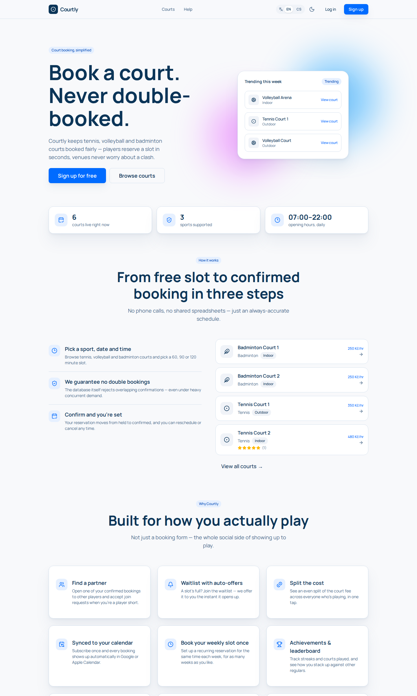
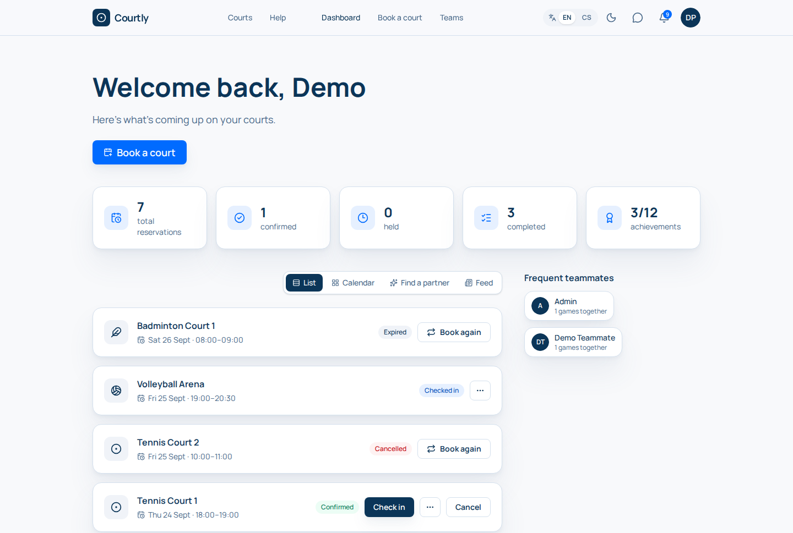

# Sports Court Reservations

A reservation system for a sports venue: players book tennis, volleyball and
badminton courts, the venue avoids double bookings, and both sides get a
reliable schedule.

Built for course **SWI**, engineering spike **C01** — see
[`docs/intent-and-change.md`](docs/intent-and-change.md) for the full domain
scope (Project Frame) and [`docs/evidence-and-evolution.md`](docs/evidence-and-evolution.md)
for the executed spike.

<p align="center">
  
  
</p>

The repository now contains a working, end-to-end slice beyond what C01
strictly requires: a FastAPI backend with register/login and a full
reservation API, and a React frontend ("Courtly") that talks to it — see
[Backend + Frontend (post-C01)](#backend--frontend-post-c01) below.

## Team — VTG Courts

| Role | Member |
|---|---|
| Member | Adam Vrána |
| Member | Marek Tyl |
| Member | Josef Glogar |
| Member | Adam Mikoláš |

- **Repository:** https://github.com/tylmarek1/C01
- **Main branch:** `main` (work via feature branches + reviewed PRs)

## Domain at a glance

| Concept | In this system |
|---|---|
| **Resource** | `Court` — sport type (TENNIS / VOLLEYBALL / BADMINTON), indoor/outdoor, active flag |
| **Reservation** | one court, one user, one time slot `[start_time, end_time)`, timestamptz |
| **User** | `Player` (books/confirms/cancels own reservations) or `Venue manager` (manages courts, can cancel any reservation) |
| **States** | `PENDING` (a 5-minute hold) `→ CONFIRMED`; on courts that require approval `PENDING → PENDING_APPROVAL → CONFIRMED / REJECTED`; `→ CANCELLED` before the start; unanswered holds/requests `→ EXPIRED`; then `CHECKED_IN → COMPLETED / NO_SHOW`. Full lifecycle: [`docs/specification.md`](docs/specification.md) |
| **Operations** | create · check availability · confirm · cancel · approve/reject (approval-required courts) |
| **Common rule** | two reservations that hold a court (`PENDING`, `PENDING_APPROVAL`, `CONFIRMED`, `CHECKED_IN`) must never overlap |
| **Domain-specific rule** | a reservation must be 60/90/120 minutes, start on `:00`/`:30`, and lie fully within opening hours 07:00–22:00 |
| **External boundary** | Notification Service — e-mails the player on confirm/cancel (stub for now) |

Full rationale, assumptions, open unknowns and the selected future pressure
(**Q — quality/scale**, 10× concurrent confirmations on popular slots) are in
[`docs/intent-and-change.md`](docs/intent-and-change.md).

## Stack

**Backend:** Python 3.12 · FastAPI · SQLAlchemy 2 · psycopg 3 · PostgreSQL 16 ·
pytest · [uv](https://docs.astral.sh/uv/) · Docker Compose
**Frontend:** React 19 · TypeScript · Vite · Tailwind CSS 4 · shadcn-style
components · React Router · TanStack Query

> The course example stack is Java/Spring; the assignment allows any stack as
> long as the team supports it and justifies the choice. We picked
> Python/FastAPI because the team is fastest in it, and PostgreSQL because
> its exclusion constraints let the database itself guarantee the common
> overlap rule under concurrency instead of relying on application-level
> locking (see ADR-000/ADR-001 in
> [`docs/architecture-and-decisions.md`](docs/architecture-and-decisions.md)).
> The repository is split into [`backend/`](backend/) and
> [`frontend/`](frontend/) (ADR-002) so each half's own toolchain — `uv` vs
> `npm` — stays unambiguous.

## Prerequisites

- [uv](https://docs.astral.sh/uv/getting-started/installation/) (installs Python 3.12 automatically)
- Node.js 20+ and npm (for the frontend)
- Docker with Compose (for PostgreSQL)

## Run

```bash
docker compose up -d --wait db   # start PostgreSQL on localhost:5432 (from the repo root)

cd backend
cp .env.example .env             # optional: falls back to the same defaults
uv sync                          # create .venv and install dependencies
uv run pytest -v                 # run tests against the real database
uv run python -m reservations.seed        # insert a few demo courts
uv run fastapi dev src/reservations/main.py &   # API at http://localhost:8000 (docs: /docs)
curl localhost:8000/health       # -> {"status":"ok"}

cd ../frontend
npm install
npm run dev                      # app at http://localhost:5173
```

Stop the database with `docker compose down` (add `-v` to wipe its data). See
[`backend/README.md`](backend/README.md) and [`frontend/README.md`](frontend/README.md)
for configuration details, the full API reference and the frontend's design
system.

## Repository layout

```
docs/course/                        the course assignments, verbatim (C01.md, C02.md, ...)
docs/project-state.md               current phase, completed/pending gates, architectural drivers
docs/definition-of-done.md          what counts as "done" (evidence-backed, not "looks complete")
docs/intent-and-change.md           Project Frame + selected future pressure
docs/architecture-and-decisions.md  architecture overview + decision records
docs/evidence-and-evolution.md      spike evidence and decisions + C02 evidence (spec -> running app)
docs/specification-v0.1.md          C02 baseline v0.1: the four core operations (frozen)
docs/specification.md               C02 specification v0.2: + approval process (current)
docs/change-c02-impact.md           impact analysis of the C02 change, architectural drivers for C03
docs/screenshots/                   README preview images
backend/                            FastAPI application (see backend/README.md)
frontend/                           React application (see frontend/README.md)
docker-compose.yml                  shared PostgreSQL instance for both apps
```

## CP1 walking skeleton

One end-to-end path that must be runnable after C03 (before C04). **Already
implemented**, ahead of that schedule, as part of the backend/frontend work
described below:

```
POST /reservations  {court_id, start_time, end_time}  (user identified by JWT bearer token)
→ validate   Pydantic schema (types, end > start) + domain slot rule
             (60/90/120 min, starts at :00 or :30, within 07:00–22:00 Europe/Prague)
→ persist    INSERT reservation with status PENDING (a hold) into PostgreSQL
→ return     201 Created {"id": "<uuid>", "status": "PENDING", ...}; 422 on invalid input
→ automated check
             pytest + httpx TestClient against the real PostgreSQL:
             valid request → 201 + row with that id exists in DB;
             slot-rule violation → 422 + no row inserted
```

`user_id` moved from the request body to the authenticated caller once
register/login existed — see ADR-003. Full endpoint list in
[`backend/README.md`](backend/README.md#api-overview).

## Engineering spike (C01)

**Variant A — Persistence.** Reservations were saved to and loaded back from
a real PostgreSQL 16 database, including a round trip test and a concurrency
test (10 threads confirming the same slot at once: 1 succeeded, 9 rejected by
a PostgreSQL exclusion constraint — no application-level locking needed).
Full question / method / result / decision write-up:
[`docs/evidence-and-evolution.md`](docs/evidence-and-evolution.md).

## Backend + Frontend (post-C01)

Beyond the C01 spike, the project now has a runnable product slice:

- **Backend API** — `POST /auth/register`, `POST /auth/login`, `GET /auth/me`
  (JWT bearer auth, bcrypt password hashing), `GET /courts`, and the full
  reservation lifecycle: `POST /reservations`, `GET /reservations`,
  `POST /reservations/{id}/confirm`, `POST /reservations/{id}/cancel` (plus approve/reject). 176
  pytest tests run against the real PostgreSQL. Details, config and the full
  API table: [`backend/README.md`](backend/README.md).
- **Frontend** — a React app ("Courtly") with a marketing landing page,
  register/login, a dashboard listing the player's reservations, and a
  booking flow (pick a court, date, duration and start time). Built from a
  single shared component library (`frontend/src/components/shared`) so every
  page reuses the same primitives and visual language instead of one-off
  markup. Details and the design-token reference:
  [`frontend/README.md`](frontend/README.md).
- **Repository split** into `backend/` and `frontend/` (ADR-002) and
  **JWT auth instead of a client-supplied `user_id`** (ADR-003) — both
  recorded in [`docs/architecture-and-decisions.md`](docs/architecture-and-decisions.md).
- Manually verified end-to-end in a real browser (register → book a court →
  confirm → cancel); along the way this caught and fixed a real bug where the
  opening-hours rule compared wall-clock hours in UTC instead of the venue's
  `Europe/Prague` time, rejecting valid slots sent by a browser in a
  different offset — now covered by a regression test.
- Known engineering gaps (Alembic migrations, a real Notification Service
  integration, frontend tests) are tracked in root `CLAUDE.md`'s "Known
  gaps" section; architectural drivers for C03 are in
  [`docs/change-c02-impact.md`](docs/change-c02-impact.md); current
  project phase and status in [`docs/project-state.md`](docs/project-state.md).

## Review cycle (C01)

The reviewed change is the whole C01 engineering spike (models, persistence
tests, evidence, ADR-001), integrated from `c01-spike` into `main`:

| Step | Who | Where |
|---|---|---|
| Task | team | issue [#4 — "C01 engineering spike — review a integrace do main"](https://github.com/tylmarek1/C01/issues/4) (original task: [#1](https://github.com/tylmarek1/C01/issues/1)) |
| Change | Marek Tyl (spike code + docs), Adam Vrána (README/team info, PRs [#2](https://github.com/tylmarek1/C01/pull/2), [#3](https://github.com/tylmarek1/C01/pull/3) into `c01-spike`) | branch `c01-spike` |
| Review before integration | **Josef Glogar** (not an author of the change) | pull request [#5](https://github.com/tylmarek1/C01/pull/5) `c01-spike → main` — **approved** 2026-09-14 10:18 |
| Integration | Josef Glogar, after approval | PR #5 **merged** into `main` 2026-09-14 10:19, issue #4 closed |

## Definition of Done — status

- [x] Team of 3–4 students
- [x] Shared repository
- [x] Clear reservation domain (sports courts)
- [x] Resource + Reservation + User modelled
- [x] Meaningful reservation states (C01: DRAFT / CONFIRMED / CANCELLED — since evolved, see [`docs/specification.md`](docs/specification.md))
- [x] Core operations defined: create, confirm/approve, cancel, check availability
- [x] Common overlap rule (enforced in PostgreSQL, verified under concurrency)
- [x] 1 domain-specific business rule (slot length/alignment/opening hours)
- [x] 1 external/system boundary (Notification Service)
- [x] Complete Project Frame
- [x] 1 selected future pressure (Q) with rationale
- [x] 1 reviewed and integrated change — PR [#5](https://github.com/tylmarek1/C01/pull/5) `c01-spike → main` approved by Josef Glogar, then merged
- [x] 1 executed engineering spike (A — Persistence)
- [x] Spike evidence + decision recorded
- [x] CP1 walking skeleton defined

All 15 items must be true before C02 starts.
