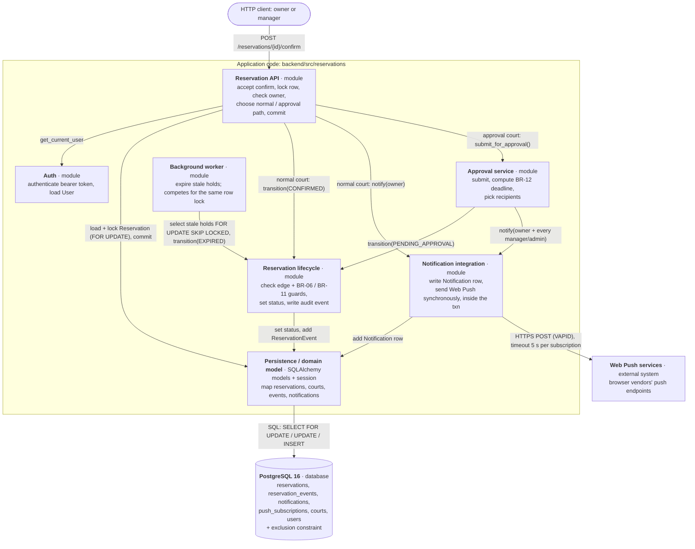
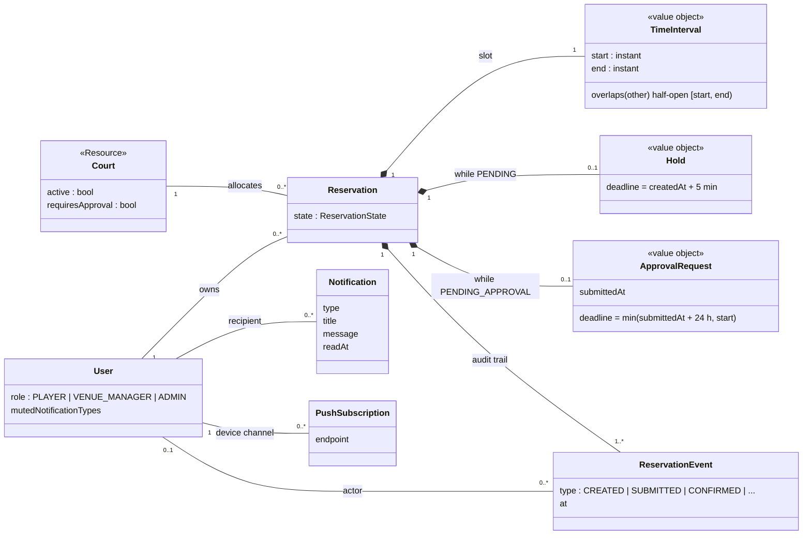
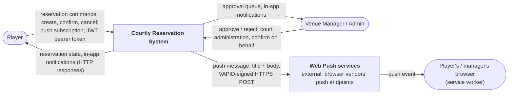
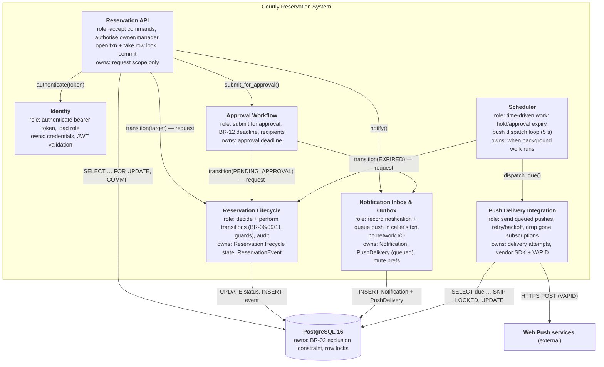
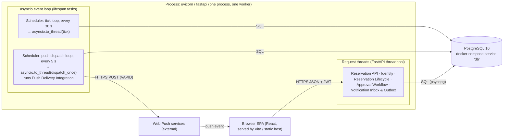
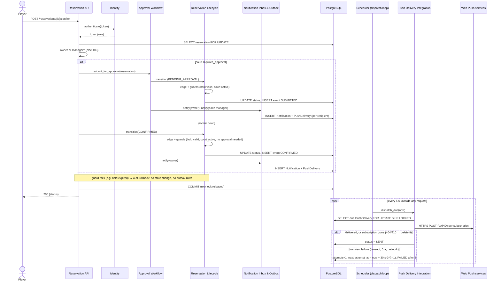
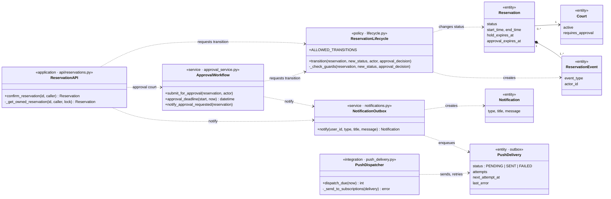

# Architecture and Decisions

## Overview

This section is a snapshot from when ADR-000 was written, kept as-is
alongside the decisions below rather than rewritten to match later
changes (§0's append-only rule for this file). For the current module map
— everything added since, including the C02 approval flow, the admin
panel and the rest of `api/` — see `docs/codebase-map.md` instead.

```
React SPA (frontend/) ──fetch, JWT bearer──► FastAPI (backend/src/reservations/main.py)
                                                │  routers: auth, courts, reservations
                                                │  request/response schemas (Pydantic)
                                                ▼
                                             domain logic (states, slot rule)
                                                │
                                                ▼
                                             SQLAlchemy ORM (models/, db.py) ──► PostgreSQL 16
                                                │
                                                └──► Notification Service (boundary, stub for now)
```

- **Stack:** Python 3.12, FastAPI, SQLAlchemy 2, psycopg 3, PostgreSQL 16, pytest, uv, Docker Compose (backend); React 19, TypeScript, Vite, Tailwind CSS 4, shadcn-style components, TanStack Query (frontend).
- **Configuration:** `DATABASE_URL`, `SECRET_KEY`, `FRONTEND_ORIGIN` environment variables for the backend (defaults in `backend/.env.example`); `VITE_API_URL` for the frontend (`frontend/.env.example`).
- **Tests** run against a real PostgreSQL started by `docker compose`, not SQLite, because we rely on PostgreSQL-specific features.

## Decisions

### ADR-000: Python/FastAPI instead of the Java/Spring stack
- **Status:** accepted (C01)
- **Context:** the team is faster in Python. The course allows another stack if the team supports it itself.
- **Decision:** use FastAPI + SQLAlchemy + PostgreSQL, with uv for reproducible dependency management (`uv.lock`).
- **Consequence:** no course support for the stack. The README must be enough for a clean checkout to build and run.

### ADR-001: Enforce "no overlapping CONFIRMED reservations" with a PostgreSQL exclusion constraint
- **Status:** accepted (C01, based on the persistence spike, see `evidence-and-evolution.md`)
- **Context:** the common business rule must hold even under our Q pressure (10× concurrent confirmations of the same slot). An application-level check (SELECT, then INSERT/UPDATE) races between concurrent transactions.
- **Decision:** `reservations` has
  `EXCLUDE USING gist (court_id WITH =, tstzrange(start_time, end_time, '[)') WITH &&) WHERE (status = 'CONFIRMED')`
  (requires the `btree_gist` extension), plus `CHECK (end_time > start_time)`.
- **Consequences:**
  - The database is the source of truth for the rule. In the spike, 10 concurrent confirmations gave 1 success and 9 `ExclusionViolation`s.
  - Half-open ranges allow back-to-back slots. DRAFT and CANCELLED rows do not block a slot.
  - The API must translate `ExclusionViolation` into HTTP 409 Conflict.
  - The project is tied to PostgreSQL, and tests must run against PostgreSQL rather than SQLite.
- **Amendment (C02, 2026-09-21):** the constraint now covers every state that holds a court — `WHERE status IN ('PENDING', 'PENDING_APPROVAL', 'CONFIRMED', 'CHECKED_IN')` (constraint name `no_overlapping_active_reservations`) — because a `PENDING` hold blocks a slot from Create onwards (the first consequence above, "DRAFT … do not block", no longer holds) and a request awaiting approval blocks too. A test fails if the constraint and `ACTIVE_RESERVATION_STATUSES` drift apart. The mechanism of ADR-001 is unchanged; see `specification.md` BR-02 and `change-c02-impact.md` driver AD-2.

### ADR-002: Split the repository into `backend/` and `frontend/`
- **Status:** accepted (post-C01, adding the walking-skeleton UI)
- **Context:** the project grew a second, independently-versioned stack (a React app) alongside the Python API. Keeping both at the repository root would mix `package.json`/`node_modules` with `pyproject.toml`/`.venv` and make it unclear which tool (`uv` vs `npm`) applies to which files.
- **Decision:** move all existing backend code (`src/`, `tests/`, `pyproject.toml`, `uv.lock`) into `backend/`, unchanged in behavior, and add the new app under `frontend/`. Each half keeps its own README with setup steps; the root README covers the project as a whole.
- **Consequences:** every backend path in this repo's docs now has a `backend/` prefix. `docker-compose.yml` stays at the repository root since it only provisions shared infrastructure (PostgreSQL).

### ADR-003: Stateless JWT bearer auth instead of server-side sessions
- **Status:** accepted (post-C01, adding register/login)
- **Context:** the API needed a way to identify the `Player` making a reservation instead of trusting a `user_id` supplied by the client. The frontend is a separate SPA origin, not server-rendered, so cookie-session affinity adds little value here.
- **Decision:** `POST /auth/register` and `POST /auth/login` return a short-lived `HS256` JWT (`sub` = user id); `bcrypt` hashes stored passwords. Protected endpoints depend on `get_current_user`, which decodes the bearer token and loads the `User` row — see `backend/src/reservations/security.py` and `deps.py`.
- **Consequences:** no server-side session store to scale or invalidate; logout is client-side only (the token is simply discarded). `SECRET_KEY` must be a real secret outside local dev — the code falls back to an insecure default so the walking skeleton still runs out of the box.

### ADR-004: In-process WebSocket registry for chat, not a message broker
- **Status:** accepted (product expansion beyond C02, "Courtly Communities" PRs #38–#44)
- **Context:** real-time chat (DM, per-reservation, and per-team) was the first feature in this codebase needing server-initiated push to a connected client — everything before it was plain request/response. A message queue or pub/sub layer (Redis, etc.) would let delivery fan out across multiple server processes, but this app has never run as more than one process (`fastapi dev`/one `uvicorn` worker) and ADR-000's stack choice already prioritized what the team can build and reason about over infrastructure it doesn't need yet.
- **Decision:** `POST /conversations/{id}/messages` (REST) is the single path a message is created through; a FastAPI `@router.websocket("/ws/chat")` route then pushes it to any of that conversation's other participants who happen to be connected, tracked in `chat_hub.py`'s in-process `dict[user_id, set[WebSocket]]`. The client authenticates the socket by sending `{"type":"auth","token":...}` as its first frame after connecting, not a `?token=` query string — the browser `WebSocket` API can't set an `Authorization` header, and a token in the URL risks landing in access/proxy logs.
- **Consequences:** delivery only reaches a recipient connected to the *same* process handling their socket — this design does not fan out across multiple workers/processes. That's the same single-process tradeoff already accepted for `rate_limit.py`'s in-memory store and `worker.py`'s in-process background task, made explicit here because it's the first time it applies to something user-visible in real time rather than a background job. If this app is ever deployed with more than one server process, chat delivery would need a shared broker (e.g. Redis pub/sub) or sticky sessions on the WebSocket route — not a change to make speculatively before it's actually needed.

## C03 Part A — AS-IS trace: Confirm Reservation

Assignment: `docs/course/C03.md` (Part A). This section shows how the code
works **today** (2026-10-05, `main` at `a26884c`), not a target design.
Code paths are relative to `backend/src/reservations/`. Every claim below
was checked in the code, in a test that passes, or in a runtime probe.
The tests are `backend/tests/test_spec_baseline.py -k ve_03` (9 passed),
`test_approval_api.py -k ve_03` (5 passed) and `test_persistence_spike.py`
(3 passed), all run against PostgreSQL 16 on 2026-10-05.

### A1. Scenario

| Item | Value |
|---|---|
| Scenario / operation | **OP-03 Confirm Reservation** (`POST /reservations/{id}/confirm`) |
| Requirements | REQ-04, REQ-05, REQ-07 |
| Rules / invariants | BR-02, BR-06, BR-09, BR-10, BR-11, BR-12 |
| Baseline | v0.2 (`docs/specification.md`) |

### A2. Main success path → code

These are the steps of the OP-03 main success scenario in v0.2. Step 5 has
two variants, depending on the court.

| v0.2 step | Realised in code | Evidence |
|---|---|---|
| 1. Accept the confirm request, authenticate the caller | `confirm_reservation()`; `get_current_user()` decodes the JWT bearer token | `api/reservations.py:450`, `deps.py:30`, `security.py:25` |
| 2. Load X and serialise against other changes to X | `_get_owned_reservation(..., lock=True)` → `db.get(Reservation, id, with_for_update=True)` (`SELECT … FOR UPDATE`) | `api/reservations.py:412-431`, line 423; VE-03.6 (Confirm‖Cancel ×20 always ends `CANCELLED`) |
| 3a. Check that the caller is the owner or a manager | same helper: `user_id != current_user.id` and role not in (`VENUE_MANAGER`, `ADMIN`) → 403 | `api/reservations.py:426-430`; VE-03.5 |
| 3b. Check that the transition is allowed (X is `PENDING`) | `transition()` looks up `ALLOWED_TRANSITIONS[status]`; an illegal edge → 409 | `lifecycle.py:19`, `:165-170`; VE-03.2 |
| 3c. Check that the hold is valid and the court is active | `_check_guards()`: `hold_expires_at < now` → 409, `not court.active` → 409 | `lifecycle.py:86-110`; VE-03.3, VE-03.4 |
| 4. Read the court's `requires_approval` flag | branch in `confirm_reservation()`: `status == PENDING and court.requires_approval` | `api/reservations.py:456-461`, `models/court.py:39` |
| 5a. *(normal court)* Set `CONFIRMED`, clear the hold, record the event | `transition(..., CONFIRMED)`: sets `status`, sets `hold_expires_at = None`, adds a `ReservationEvent(CONFIRMED)` | `lifecycle.py:174-188`; VE-03.1, VE-03.8b |
| 5b. *(approval court)* Set `PENDING_APPROVAL`, set the deadline, notify the managers | `approval_service.submit_for_approval()` → `transition(..., PENDING_APPROVAL)` (event `SUBMITTED`), then `approval_deadline()` = `min(now + 24 h, start)`, then `notify_approval_requested()` | `approval_service.py:23-58`; VE-03.8, VE-03.9 |
| 6a. Notify the owner | `notify()` writes a `Notification` row **and** synchronously calls `_send_web_push()` | `api/reservations.py:466-472`, `notifications.py:57-70` |
| 6b. Save the result and return the new state | `db.commit()`, then `db.refresh()`, then `ReservationOut` | `api/reservations.py:473-481` |

Confirm does not run a separate "evaluate conflict" step (the course
template's row). Under v0.2 D-08 it cannot fail on overlap: the `PENDING`
hold already occupies the slot, and BR-02 is enforced by the exclusion
constraint (ADR-001). The `except IntegrityError → 409` at
`api/reservations.py:475` is the backstop that D-08 describes. Under the
current constraint it cannot trigger, because a `PENDING → CONFIRMED`
update stays inside the constraint's `WHERE` set and keeps the same range.

### A3. Alternative branch: hold expired → reject (BR-06, REQ-05)

| What v0.2 says | Where the condition is detected | Where the outcome is decided | What the caller gets |
|---|---|---|---|
| A `PENDING` hold whose `hold_deadline < now` cannot be confirmed (`CONFLICT`, state unchanged). The system sweeps it to `EXPIRED` within one cycle. "Confirm vs hold expiry → the deadline decides." | **Two places**, depending on whether the worker has run yet. (1) Not swept yet: `_check_guards()` compares `hold_expires_at < now` (`lifecycle.py:100-105`). (2) Already swept: `worker._expire_stale_holds()` selected the row with `FOR UPDATE SKIP LOCKED` and moved it to `EXPIRED` (`worker.py:35-59`, tick every 30 s, `worker.py:32`). Confirm then sees status `EXPIRED`. | (1) `_check_guards()` raises `HTTPException(409)`. (2) `transition()` finds no `EXPIRED → CONFIRMED` edge in `ALLOWED_TRANSITIONS` (`lifecycle.py:165-170`) and raises `HTTPException(409)`. Either way nothing is committed. | HTTP 409 with `"This hold has expired — book the slot again"` (case 1) or `"Cannot move a EXPIRED reservation to CONFIRMED"` (case 2). Reservation unchanged; the slot stays blocked until the sweep (VE-03.3, VE-03.7). |

Differences between v0.2 and the implementation found during this trace:

| Specification (v0.2) | Implementation | Evidence |
|---|---|---|
| Success postcondition: "owner notified 'Reservation confirmed'" / "'Approval requested'"; on an approval court "**every** Venue Manager notified". | `notify()` returns `None` and writes nothing if the recipient muted that notification type. An owner or manager who muted it gets no notification. The spec does not mention muting. | `notifications.py:60-64`; preferences in `api/notifications.py:33` |
| BR-10: "owner **or a Venue Manager**" may confirm; "every Venue Manager" is notified. | The `ADMIN` role is accepted as a manager and also receives the "Approval needed" notification. The spec never mentions `ADMIN`. | `api/reservations.py:426-429`, `approval_service.py:41-44`, `deps.py:50` ("ADMIN inherits everything a manager can do") |
| The A3 branch itself (expired hold → `CONFLICT`). | Matches v0.2. | VE-03.3 passes |

### A4. Main implementation parts

The scenario passes through about a dozen classes and functions, so the
blocks below are logical modules at the same level of detail.

| Part | Type / contents | Role in this scenario | Evidence |
|---|---|---|---|
| **Reservation API** | module: `api/reservations.py` (`confirm_reservation`, `_get_owned_reservation`) | accepts the command, loads and locks the row, checks ownership, chooses the normal or approval path, commits, maps errors to 409 | `api/reservations.py:412-481` |
| **Auth** | module: `deps.py` (`get_current_user`), `security.py` (`decode_access_token`) | authenticates the bearer token and loads the caller's `User` | `deps.py:30-46` |
| **Reservation lifecycle** | module: `lifecycle.py` (`transition`, `_check_guards`, `ALLOWED_TRANSITIONS`) | decides whether the transition is legal (edge table, BR-06/BR-11 guards), changes the state, writes the audit event | `lifecycle.py:19-188` |
| **Approval service** | module: `approval_service.py` (`submit_for_approval`, `approval_deadline`, `notify_approval_requested`) | approval-court variant: submits the reservation, computes the BR-12 deadline, picks the recipients | `approval_service.py:23-58` |
| **Notification integration** | module: `notifications.py` (`notify`, `_send_web_push`) | writes in-app `Notification` rows and sends Web Push to each of the recipient's subscriptions | `notifications.py:15-70` |
| **Persistence / domain model** | SQLAlchemy models `Reservation` (+ `ReservationStatus`, `ACTIVE_RESERVATION_STATUSES`, the exclusion constraint), `Court`, `ReservationEvent`, `Notification`, `PushSubscription`; session from `deps.get_db` / `db.py` | maps rows to objects. The model is anemic: no behaviour on `Reservation` itself, so the logic lives in `lifecycle.py` | `models/reservation.py`, `models/court.py`, `db.py:12-16` |
| **Background worker** *(competing writer, not called by Confirm)* | module: `worker.py` (`_expire_stale_holds`) | the other party in the A3 race: expires the same row under a row lock | `worker.py:35-59` |

### A5. State, state change, one rule

**State**

| Question | Answer | Evidence |
|---|---|---|
| Where is the Reservation state stored durably? | PostgreSQL table `reservations`: columns `status` (enum `reservation_status`), `hold_expires_at`, `approval_expires_at`. The history goes in `reservation_events`. There is no other copy: no cache, and the worker reads the same rows. | `models/reservation.py:38-77`; `lifecycle.py:181-188` |
| Which code decides and performs the transition? | **Decides:** `confirm_reservation()` chooses the target state (`CONFIRMED` or `PENDING_APPROVAL`, `api/reservations.py:456-466`). `lifecycle.transition()` + `_check_guards()` decide whether it is allowed. **Performs:** `transition()` assigns `reservation.status` (`lifecycle.py:174`). It becomes durable only at `db.commit()` in the router (`api/reservations.py:474`). Serialisation is not enforced inside `transition()`: its docstring makes holding a `FOR UPDATE` lock the *caller's* responsibility (`lifecycle.py:151-161`). | as cited |

**Rule: BR-11 (approval invariant).** On an approval-required court, Confirm must never produce `CONFIRMED`.

| Question | Answer | Evidence |
|---|---|---|
| Where is the rule's condition detected? | `court.requires_approval` is read in **two** places: the router branch (`api/reservations.py:456-458`) and the lifecycle guard (`lifecycle.py:112-116`). | as cited |
| Where is the outcome decided? | **Both places decide independently.** The router sends a `PENDING` reservation on an approval court to `submit_for_approval()`, so Confirm is a submission. The lifecycle guard rejects any `PENDING → CONFIRMED` on such a court with 409, whoever the caller is. That is the backstop for the other routes to `CONFIRMED` (waitlist accept, manager on behalf; v0.2 D-15). A third check, `approval_decision=True`, means only Approve/Reject can take `PENDING_APPROVAL → CONFIRMED` (`lifecycle.py:122-130`). | VE-03.8, VE-03.9, VE-03.10 |
| Where is the resulting state change made? | `transition(..., PENDING_APPROVAL)` called from `approval_service.submit_for_approval()` (`approval_service.py:56`). The deadline is set right after it, outside `transition()` (`approval_service.py:57`). | as cited |

For contrast, **BR-02** (no overlap) is not decided in application code at
all. It is the PostgreSQL exclusion constraint `no_overlapping_active_reservations`
(`models/reservation.py:45-51`, ADR-001). Confirm relies on it only
indirectly, through the hold.

### A6. Dependencies used by this scenario

| Dependency | Where it connects to our code | Which part knows its technical API | Evidence |
|---|---|---|---|
| **PostgreSQL 16** (database) | the SQLAlchemy session per request (`deps.get_db`), the row lock `SELECT … FOR UPDATE`, the exclusion constraint (GiST + `btree_gist`) | `db.py` (engine), `models/` (schema, `ExcludeConstraint`); the router uses `with_for_update` and catches `IntegrityError`, so the API layer also knows DB locking and error semantics | `api/reservations.py:423`, `:475`; `models/reservation.py:45-51` |
| **Web Push services** (external: browser vendors' push endpoints, via `pywebpush` + VAPID keys) | `notifications._send_web_push()`, called from `notify()` | only `notifications.py` (`webpush(...)`, VAPID claims, 404/410 handling, `timeout=5`) | `notifications.py:15-54`; `config.settings.vapid_*` |
| **Identity**: an internal JWT, not an external IdP | `deps.get_current_user` → `security.decode_access_token` (HS256, `SECRET_KEY`) | `security.py`, `deps.py` | ADR-003; `deps.py:30-46` |

There is no external Notification Service. "Notification" means a row in
our own `notifications` table plus a Web Push call. (ADR-000's overview
still shows a "Notification Service (boundary, stub for now)". The Web
Push path has replaced that stub; the overview is kept as a snapshot.)

### A7. AS-IS structural diagram



Arrows show the direction of the call. The background worker is not called
by Confirm. It is drawn because it writes the same row concurrently (A3);
its own notify/persistence calls are left out for brevity.

Block contents:

- **Reservation API**: `api/reservations.py` — `confirm_reservation`, `_get_owned_reservation`
- **Auth**: `deps.get_current_user`, `security.decode_access_token`
- **Reservation lifecycle**: `lifecycle.py` — `transition`, `_check_guards`, `ALLOWED_TRANSITIONS`
- **Approval service**: `approval_service.py` — `submit_for_approval`, `approval_deadline`, `notify_approval_requested`
- **Notification integration**: `notifications.py` — `notify`, `_send_web_push`
- **Persistence / domain model**: `models/reservation.py` (`Reservation`, `ReservationStatus`, the exclusion constraint), `models/court.py`, `models/reservation_event.py`, `models/notification.py`, `models/push_subscription.py`, `db.py`, `deps.get_db`
- **Background worker**: `worker.py` — `_expire_stale_holds`, `tick`

### A8. Question for the next part of C03

| Item | Content |
|---|---|
| Question | **Should sending notifications (especially external Web Push) stay inside the transaction that holds the reservation's row lock, or move after commit (e.g. an outbox processed asynchronously)?** |
| Evidence | `confirm_reservation()` takes `SELECT … FOR UPDATE` (`api/reservations.py:423`) and calls `notify()` → `_send_web_push()` **before** `db.commit()` (`:466-474`). `webpush()` is a synchronous HTTPS call with `timeout=5` per subscription (`notifications.py:42`). On an approval court the loop runs over every manager and admin and each of their subscriptions (`approval_service.py:41-52`). **Runtime probe (2026-10-05, temporary test, not committed):** with `webpush` replaced by a function that queries the database from a second session during the push, the second session's `SELECT … FOR UPDATE` failed with `LockNotAvailable`, and the committed status it saw was still `PENDING`. The API then returned `200 CONFIRMED`. The hold-expiry worker follows the same pattern: it calls `notify()` while holding the row lock (`worker.py:50-56`). So the push "Reservation confirmed" goes out while the change is uncommitted and the row is locked. |
| Why it matters | **REQ-07 / AD-3:** every competing writer on that row (Cancel, Approve, Reject, the expiry worker) waits up to *n × 5 s* for external endpoints. The worker uses `SKIP LOCKED`, so a slow push silently delays the BR-06/BR-12 sweep. **Consistency:** if the commit fails (D-08's 409 backstop, or a connection error), the user has already received a push about a state change that never happened. `notifications.py:17-24` calls this "theoretical", but Confirm does fallible work (`db.commit()`) after `notify()`. **AD-5:** there is no retry or delivery guarantee for the person who has to act on an approval. This decides where the notification boundary sits in the target architecture. |

## C03 — Architecture: Confirm Reservation and the notification boundary

Assignment: `docs/course/C03.md` (the full C03 after Part A). This section
builds on the Part A trace above, which is the AS-IS record and is not
rewritten. Scenario: **OP-03 Confirm Reservation** (Baseline v0.2, REQ-04,
REQ-05, REQ-07). Code paths are relative to `backend/src/reservations/`.
Implementation commit: `65aad78`.

**What changed in Part A since it was written:** only the notification
path. A2 row 6a, the A6 "Web Push services" row, A7's "Notification
integration" block and the A8 question describe code that was replaced
in K below. In the TO-BE design, `notify()` makes no network call, and
Web Push is sent by `push_delivery.py`. Every other Part A item still
matches the code.

### B. Architectural drivers

This builds on C02's AD-1…AD-6 (`docs/change-c02-impact.md` §3) and the
Part A findings. BR-02 concurrency is **not** reopened: ADR-001 already
puts it in the database, and the Part A trace confirmed that Confirm
cannot break it (D-08).

| # | Source | Why it affects the architecture | Question the architecture must answer |
|---|---|---|---|
| **DR-1** | REQ-07, AD-3; Part A A5/A8 (row lock held while `notify()` ran) | Every state change on one reservation (Confirm, Cancel, Approve, Reject, both expiries) is serialised on that row's `FOR UPDATE` lock. Anything done while the lock is held adds to the wait of every competing writer, and the expiry sweep uses `SKIP LOCKED`, so it silently skips locked rows. | What may run while a reservation's row lock is held? In particular, may an external call run there? |
| **DR-2** | OP-03 postconditions ("owner notified", "every Venue Manager notified"), AD-5; Part A A8 runtime probe | Telling the person who must act (a manager approving) is part of the behaviour. The external push service can be slow or down, and the AS-IS code sent a push for a change that was not committed yet. | Should a notification failure change the outcome of Confirm? Who retries? Can a notification ever announce a change that rolled back? |
| **DR-3** | BR-09, BR-11, REQ-11, AD-4; Part A A5 (BR-11 checked in two places, the router picks the target state) | The approval rule is worthless if any path reaches `CONFIRMED` around it. Several entry points (Confirm, Approve, waitlist, worker) change one lifecycle. | Who owns each transition decision, and who may only *request* a transition? |
| **DR-4** | BR-06, BR-12, REQ-05, REQ-10, AD-1 | A `PENDING_APPROVAL` request outlives its HTTP request by up to 24 h. Its expiry, and the hold's, must fire even if nobody calls the API. | Who owns the pending approval state, and who performs the later time-driven or manager-driven transitions? |

### C1. Domain class model (Confirm + approval slice)



Invariants attached to the relationships:
- **Court–Reservation (BR-02):** the blocking reservations (`PENDING`, `PENDING_APPROVAL`, `CONFIRMED`, `CHECKED_IN`) of one court never have overlapping `TimeInterval`s.
- **Reservation–ApprovalRequest (BR-11/BR-12):** exists only while the state is `PENDING_APPROVAL`. It is created only if `Court.requiresApproval`, and only a Venue Manager's Approve/Reject (or expiry) ends it.
- **Reservation–Hold (BR-06):** exists only while `PENDING`. An expired hold cannot be confirmed.

`Hold` and `ApprovalRequest` are domain concepts. In code they are the
columns `hold_expires_at` and `approval_expires_at` on `reservations`
(Part A A5), not separate tables. The model is consistent with v0.2 §1–§3
and with the Project Frame's core concepts. "Time slot" became
`TimeInterval`, and the notification concepts were added for DR-2.

### C2. System responsibilities

| # | Source | Responsibility | What it must decide / own | One clear owner? | Why | Group with (shared state/invariant) | Separate from (different change reason, failure/trust boundary, tech) |
|---|---|---|---|---|---|---|---|
| R1 | BR-10 | Authenticate the caller; check owner-or-manager / manager-only | identity, role | yes | two authorisation rules for one operation would drift | — | lifecycle rules (identity tech and token format change for their own reasons, ADR-003) |
| R2 | OP-03, BR-09, BR-06, BR-11, statechart | Decide whether a transition is allowed and perform it, including Confirm's target per court | Reservation state, guards, audit event | **yes** | entry points must not decide differently (DR-3) | R4 (same row), the audit event | HTTP parsing; notifications; scheduling |
| R3 | BR-02, REQ-02 | Keep blocking reservations non-overlapping under concurrency | the exclusion constraint | **yes** | only one mechanism is race-free (ADR-001) | reservation persistence | application code (a Python check would race) |
| R4 | REQ-07, DR-1 | Serialise changes to one reservation; keep the critical section short | row lock scope | yes | a lock taken differently in each path reopens races | R2 | any external I/O (DR-1) |
| R5 | BR-11, BR-12, DR-4 | Manage the approval request: submit, compute the deadline, choose who must be told | approval deadline, recipient set | yes | the request outlives the HTTP request | R2 (it requests transitions from R2) | authorisation of the approver (R1), delivery (R8) |
| R6 | BR-06, BR-12, REQ-05/10, DR-4 | Fire time-driven transitions and background work | when expiry/dispatch runs | yes | must run without a request | — | request handling (different runtime trigger) |
| R7 | OP-03 postconditions, DR-2 | Record a notification for the recipient atomically with the business change | `Notification` row, mute preference, the queued push | yes | "owner notified" must be true iff the change committed | the business transaction | external delivery (R8) |
| R8 | DR-1, DR-2, AD-5 | Deliver the notification over Web Push: retry, give up, drop dead subscriptions | delivery attempts, vendor API (VAPID, `pywebpush`) | **yes, by design** | an external failure must have exactly one, explicit handler | `PushSubscription` | all business logic (external technology, failure boundary, vendor-driven change) |

### D. Decision question

> **Where should the Web Push integration be isolated, and when, relative
> to the business transaction and its reservation row lock, should a
> notification be delivered? In other words, what does a slow or failing
> push service mean for Confirm Reservation?**

This follows from DR-1 and DR-2. It affects structure (who may import the
vendor SDK), interaction (sync vs. async), runtime (which loop sends) and
ownership of delivery state. The AS-IS code (send inside the transaction,
under the lock) is the baseline that both alternatives must improve on.

### E1. Two materially different alternatives

**Alternative A: send after commit, inside the request.**

```
[Reservation API] --commit--> [PostgreSQL]
        |
        | after commit: send collected pushes (sync, best effort)
        v
[Push Integration] --HTTPS--> [Web Push services]
```

`notify()` writes the `Notification` row and collects the pending pushes
in the session. After a successful `db.commit()`, the request handler
calls the push integration synchronously, then returns the response.
There is no persistent delivery state and no retry.

**Alternative B: transactional outbox and background dispatcher.**

```
[Reservation API] --notify()--> [Notification Inbox/Outbox] --INSERT Notification + PushDelivery--> [PostgreSQL]
                                                                                                     ^
[Scheduler loop, every 5 s] --dispatch_due()--> [Push Delivery Integration] --SELECT … SKIP LOCKED---+
                                                         |
                                                         +--HTTPS (VAPID)--> [Web Push services]
```

`notify()` writes the `Notification` row **and** a `push_deliveries`
outbox row in the caller's transaction. A dedicated background loop sends
committed outbox rows, retries with backoff and records the result.

### E2. Comparison against the drivers

| Criterion (driver) | A — after commit, in request | B — outbox + dispatcher |
|---|---|---|
| Lock duration (DR-1) | Lock released at commit. The push happens after it, so other writers no longer wait. | Lock released at commit. The request never touches the push service. |
| Consistency: no push for a rolled-back change (DR-2) | Holds: sends only after a successful commit. | Holds: the outbox row commits or rolls back with the change. |
| Durability: a committed change is eventually notified (DR-2) | **No.** A crash, deploy or restart between commit and send loses the push. A push-service outage loses it too (no retry). | **Yes** (at least once). The row survives restarts. A transient failure is retried after 30 s, 1 min, 2 min and 4 min, then `FAILED` (the in-app row still exists). |
| Caller-visible latency / failure (DR-2) | Confirm's HTTP response waits for (recipients × subscriptions) × up to 5 s. On an approval court that means every manager's devices. The push service's health leaks into API latency. | Response time is independent of the push service (12 ms measured in K). The push arrives ≤ 5 s + send time after commit. |
| Ownership / change (DR-3-style single owner) | The vendor SDK is isolated in one module, but the *trigger* is in every route that commits (each must remember the after-commit call) or in a session hook. | Vendor SDK and delivery state are owned by one module. Business code only calls `notify()`. One trigger (the scheduler loop). |
| Operational complexity | No new table or loop. | One new table (`push_deliveries`, picked up by `create_all`), one more background loop, a backlog to watch (`status = FAILED`). |

### E3. Walkthrough: Confirm on an approval-required court, with the push service hanging and a concurrent Cancel

| Step / event | Alternative A | Alternative B |
|---|---|---|
| Confirm starts | API locks the row (`FOR UPDATE`), checks owner, hold, court | same |
| Approval needed (OP-03 step 5b) | `submit_for_approval()` → `PENDING_APPROVAL`, deadline, `Notification` rows for the owner and N managers; N+1 pushes collected in memory | same transition and rows, plus N+1 `push_deliveries` rows in the same transaction |
| Commit / request ends | Commit releases the lock. The request then makes N+1 (× subscriptions) synchronous HTTPS calls; with the service hanging, each takes the 5 s timeout before the response is sent. | Commit releases the lock; response returned immediately (`PENDING_APPROVAL`) |
| Concurrent Cancel by the owner (REQ-07) | Not blocked (the lock is gone), so it ends `CANCELLED`. The Confirm caller is still waiting for its own response, and managers may get "Approval needed" for a request that is already cancelled. | Not blocked, ends `CANCELLED`. The dispatcher may still deliver "Approval needed" *and then* the cancellation notice. Both are true, committed facts, in creation order. |
| Push service down | Pushes lost; only a log line. In-app notifications remain. | Rows stay `PENDING` and are retried; `FAILED` after 5 attempts; in-app notifications remain. Confirm's outcome is unaffected in both. |
| Process crash right after commit | Pushes lost | Rows survive; sent after restart |
| Commit fails (D-08 backstop or DB error) | Nothing sent | Outbox rows rolled back; nothing sent |
| Approval comes later (OP-05, a separate request) | Same pattern in the Approve request: "Reservation approved" waits on the push service | Approve commits `CONFIRMED` + outbox row; dispatcher sends it |

Both alternatives implement the required behaviour (state, in-app
notification, BR-02/BR-11) and both fix the Part A defect. They differ in
DR-2 (durability, caller latency) and in who owns delivery.

### ADR-005: Deliver Web Push through a transactional outbox drained by a background dispatcher

- **Status:** accepted (C03, 2026-10-05). Implemented in `65aad78`.
- **Context:** the C03 Part A trace and its runtime probe showed that `notify()` made synchronous Web Push calls (5 s timeout each) inside the caller's transaction. For Confirm, that meant while holding the reservation's `FOR UPDATE` lock, and before commit, so a push could announce an uncommitted change. On an approval court the call is repeated for every manager and device.
- **Drivers:** DR-1 (lock scope, REQ-07), DR-2 (notification after a business change, failure and retry, AD-5); secondarily DR-4 (work that outlives the request).
- **Alternative A:** send after commit, synchronously, inside the request. No new state, but pushes are lost on crash or outage, and the API response waits for the push service.
- **Alternative B:** a transactional outbox (`push_deliveries`) written by `notify()` in the business transaction, sent by a dispatcher loop in the background worker with retry and backoff.
- **Decision:** B. `notify()` does no network I/O. It writes the `Notification` and, if the user has a subscription, a `PushDelivery` row. `push_delivery.py` is the only module that imports `pywebpush`. It sends due rows (`FOR UPDATE SKIP LOCKED`, batch 50), deletes subscriptions the push service reports gone (404/410), and retries other failures after 30 s, 1 min, 2 min and 4 min, then marks the row `FAILED`. The loop lives in `worker.py` (the scheduler owns all time-driven work, per `backend/CLAUDE.md`), runs every 5 s, and does its blocking work in a thread (`asyncio.to_thread`).
- **Why:** it is the only option where a committed change is eventually pushed (DR-2) and where neither the row lock nor the API response depends on an external service (DR-1). Delivery state and the vendor API get exactly one owner (R8).
- **Accepted negative consequences:**
  - A push arrives up to ~5 s after the change. The in-app notification is immediate.
  - Delivery is *at least once*: a delivery that reached one device and failed transiently on another is retried as a whole.
  - Every malformed or misconfigured subscription is retried five times before `FAILED`, because non-`WebPushException` errors count as transient.
  - There is a new table that grows without clean-up, and `FAILED` rows are only visible in the database.
  - The dispatcher holds `FOR UPDATE` on its outbox batch while sending. These rows are not reservations, and `SKIP LOCKED` keeps a second dispatcher from blocking on them.
  - Like the rest of `worker.py`, the loop assumes a single process (AD-1, ADR-004).
- **Reopen when:**
  - push latency of a few seconds becomes a product problem;
  - the app runs as more than one process, and a scheduler or leader election is needed;
  - a second external channel (e-mail/SMS) appears, which could make a broker or a provider-neutral delivery service worth it;
  - outbox volume needs retention or monitoring;
  - per-subscription delivery state is needed to avoid duplicate pushes.

### G1. System context



There is no external IdP: identity is the system's own JWT and password
store (ADR-003). The database is part of the system, not an external
system. Time-driven behaviour (expiry) is triggered internally by the
system clock.

### G2. TO-BE static architecture



The ADR-005 decision is visible in the diagram: there is **no** dependency
from the Inbox/Outbox (called inside business transactions) to Web Push.
The only path to the external service is Scheduler → Push Delivery
Integration → Web Push.

Each C2 responsibility has exactly one owner:

| Responsibility | Owner |
|---|---|
| R1 | Identity, which authenticates. The owner-or-manager check is the Reservation API's request-level authorisation. |
| R2 | Reservation Lifecycle |
| R3 | PostgreSQL (exclusion constraint, ADR-001) |
| R4 | Reservation API, which takes the lock and bounds the critical section to the transaction |
| R5 | Approval Workflow |
| R6 | Scheduler |
| R7 | Notification Inbox & Outbox |
| R8 | Push Delivery Integration |

Code mapping:

| Element | Code |
|---|---|
| Reservation API | `api/reservations.py` |
| Identity | `deps.py`, `security.py` |
| Reservation Lifecycle | `lifecycle.py` |
| Approval Workflow | `approval_service.py` |
| Scheduler | `worker.py` |
| Notification Inbox & Outbox | `notifications.py`, `models/notification.py`, `models/push_delivery.py` |
| Push Delivery Integration | `push_delivery.py`, `models/push_subscription.py` |

### G3. Transition ownership (v0.2 statechart §5.2)

v0.2 has no `DRAFT` state, so the course's example rows map to `PENDING`.

| Transition | Decision owner (G2) | May only request it |
|---|---|---|
| `PENDING → CONFIRMED` | Reservation Lifecycle (`transition()` edge table + `_check_guards`: hold, court active, **court does not require approval**) | Reservation API (Confirm on a normal court) |
| `PENDING → PENDING_APPROVAL` | Reservation Lifecycle (edge table + hold/court guards) | Approval Workflow (`submit_for_approval`, on behalf of the API's Confirm) |
| `PENDING_APPROVAL → CONFIRMED` | Reservation Lifecycle (guard: `approval_decision`, deadline, court active) | Reservation API's Approve, manager-only via Identity |
| `PENDING_APPROVAL → REJECTED` | Reservation Lifecycle (guard: `approval_decision`, deadline) | Reservation API's Reject, manager-only |
| `PENDING → EXPIRED`, `PENDING_APPROVAL → EXPIRED` | Reservation Lifecycle (edge table) | Scheduler (`_expire_stale_holds`, `_expire_stale_approvals`) |
| `PENDING / PENDING_APPROVAL / CONFIRMED → CANCELLED` | Reservation Lifecycle (`check_cancellable` + edge table) | Reservation API's Cancel |

The API *chooses* which transition to request (normal vs. approval
court), but it never decides alone. If it requested `CONFIRMED` on an
approval court, the Lifecycle guard rejects it with 409 (VE-03.9/03.10,
`lifecycle.py:112-120`). The Lifecycle is therefore the single decision
owner for DR-3.

### G4. Runtime / deployment mapping



All logical elements run in one deployable, the backend process (ADR-000,
ADR-004). The Push Delivery Integration only runs in the dispatch loop's
thread, never in a request thread. That is ADR-005 seen at runtime.

### H1. Design sequence: Confirm Reservation (TO-BE)



Every participant is a G2 element (or the actor, the database, or the
external system), and every call follows a G2 arrow.

### H2. Focused design class diagram



Operation owners for H1 messages:

| H1 message | Owner |
|---|---|
| `confirm` | `ReservationAPI` |
| `submit_for_approval` | `ApprovalWorkflow` |
| `transition` | `ReservationLifecycle` |
| `notify` | `NotificationOutbox` |
| `dispatch_due` | `PushDispatcher`. The 5 s loop that calls it is `worker.run_push_dispatcher` (Scheduler, G4). |

There is no repository interface: the design deliberately keeps
SQLAlchemy sessions (ADR-000). The `PushSubscription` lookup is internal
to `PushDispatcher`.

### I. Cross-view check (done before the code change)

| Check | Result | Issue found → resolution |
|---|---|---|
| C02 ↔ G2 | OK | OP-03's "owner / every manager notified" maps to the in-app `Notification`, which is still written in the business transaction, so the postcondition holds at commit. Push is an extra channel that v0.2 does not specify. The Part A mute/`ADMIN` gaps are spec questions, not architecture, and are left for the spec owners. |
| C2 ↔ G2 | **fixed** | AS-IS, R7 (record) and R8 (deliver) had one shared owner, `notify()`. Split into Notification Inbox & Outbox and Push Delivery Integration. R2: both the API branch and the Lifecycle guard looked like deciders (Part A A5). Resolved by defining the Lifecycle as decision owner and the API as requester (G3). No code change was needed, because the guard already rejects a wrong request. |
| G2 ↔ H1 | **fixed** | The first draft drew the dispatch loop inside Push Delivery Integration. `backend/CLAUDE.md` makes `worker.py` the only place for time-driven work, so the loop belongs to the Scheduler: a Scheduler → Push Delivery arrow was added in G2, and H1 uses it. |
| H1 ↔ H2 | OK | Each H1 message has an owning class (table above). |
| statechart ↔ G3/H1 | **found, not in this slice** | `api/waitlist.py:115-122` constructs a reservation directly in `CONFIRMED`/`PENDING_APPROVAL` without going through the Lifecycle. This contradicts G3 and `backend/CLAUDE.md`'s rule. Waitlist is outside baseline v0.2 (§9) and outside OP-03, so it is recorded as a remaining risk (AD-4) rather than changed here. Confirm itself conforms. |
| G2 ↔ G4 | **fixed** | AS-IS `worker.run_forever` called the synchronous `tick()` directly on the event loop, so a long tick (or its pushes) stalled every API request. With push work moving to the scheduler, both loops now run their work via `asyncio.to_thread` (G4). |
| ADR ↔ G2/G4 | OK | No Inbox → Web Push arrow (G2). The dispatcher is a separate loop thread (G4). The rule is enforced by L2. |

### J. AS-IS → TO-BE delta

| Area | AS-IS (Part A) | TO-BE (G/H) | Action |
|---|---|---|---|
| Where Web Push is sent | `notify()` → `_send_web_push()` inside the business txn, under the row lock, before commit | Outbox row in the txn; sent after commit by the dispatcher | **CHANGE** |
| Vendor SDK (`pywebpush`) | imported by `notifications.py`, called on every `notify()` path | only `push_delivery.py` | **CHANGE** + rule (L2) |
| Push failure handling | log and drop; 404/410 deletes the subscription | retry with backoff, `FAILED` after 5; 404/410 deletes the subscription | **CHANGE** |
| Background loop execution | `tick()` run synchronously on the event loop; no dispatch loop | tick + 5 s dispatch loop, both via `asyncio.to_thread` | **CHANGE** |
| Confirm transition decision | API picks the target; Lifecycle guard is authoritative | same (Lifecycle owns, API requests, G3) | KEEP |
| Row lock for Confirm/Cancel/Approve/Reject | `_get_owned_reservation(lock=True)` | same; lock scope = business txn only | VERIFY: VE-03.6 race test + the new boundary test |
| BR-02 enforcement | PostgreSQL exclusion constraint (ADR-001) | same | KEEP |
| In-app `Notification` row in the business txn | yes | yes | KEEP |
| Only Lifecycle changes reservation status | Confirm/Approve/Reject/Cancel/worker conform; waitlist accept bypasses it | all paths through the Lifecycle | VERIFY: failed for waitlist accept (out of slice, see I and remaining risk) |

### K. Implementation (commit `65aad78`)

- `models/push_delivery.py` (new table `push_deliveries`, enum `push_delivery_status`): the outbox. It is a new table only, so `create_all` creates it with no manual DB cycle (`backend/CLAUDE.md`).
- `notifications.py`: `notify()` writes the `Notification` and, if the user has a push subscription, a `PushDelivery`. The `pywebpush` import and the HTTP code were removed.
- `push_delivery.py` (new): `dispatch_due()`, `dispatch_once()`, retry/backoff/give-up, gone-subscription clean-up.
- `worker.py`: `run_push_dispatcher()` added; `run_forever()` now uses `asyncio.to_thread(tick, …)`. `main.py` starts both loops in `lifespan`.
- `tests/test_push_api.py`: the push tests now go through the dispatcher. New tests cover the commit-before-push boundary, rollback, mute, retry/give-up and gone subscriptions. `tests/test_architecture.py` is the L2 rule.
- Build/run: `uv run uvicorn reservations.main:app` started cleanly. Confirm returned `200 CONFIRMED` in 12 ms. Within ~5 s the dispatcher had attempted both queued pushes (the fake subscription failed on its keys), recorded the error and scheduled a retry. No errors appeared in the app log.

### L1. Behaviour verification (after the change, 2026-10-05, PostgreSQL 16)

| Verification | Result | Evidence |
|---|---|---|
| Success path (VE-03.1, 03.8, 03.8b, 03.9) | pass | `pytest tests/test_spec_baseline.py -k ve_03` → 9 passed; `tests/test_approval_api.py` → 38 passed |
| Chosen alternative/failure: expired hold → 409, state unchanged, then swept (VE-03.3, 03.7) | pass | included in the 9 above |
| Failure at the new boundary: push service down → Confirm still `200 CONFIRMED`; delivery retried, then `FAILED`; subscription kept | pass | `test_a_transient_push_failure_is_retried_with_backoff_then_given_up` |
| Boundary: no push before commit or under the row lock | pass | `test_confirm_commits_before_any_push_is_attempted`: the request makes 0 push calls; the dispatcher's pushes see `CONFIRMED` and take the row lock with `NOWAIT` |
| Concurrency: Confirm‖Cancel ×20 (VE-03.6), concurrent creates (VE-01.9) | pass | `-k "ve_03_6 or ve_01_9"` → 2 passed; `test_persistence_spike.py` + `test_worker.py` → 9 passed |
| Whole suite | pass | `uv run pytest` → **305 passed** |

### L2. Architecture rule

- **Architectural rule:** only the Push Delivery Integration (`push_delivery.py`) may use the Web Push vendor SDK (`pywebpush`). Business code reaches Web Push only through the outbox (ADR-005, G2).
- **Check:** `backend/tests/test_architecture.py` parses every module under `src/reservations/` with `ast` and fails if any module other than `push_delivery.py` imports `pywebpush`. A second test makes sure the scan really sees the allowed import, so a wrong path cannot make it pass vacuously. It runs with the normal `uv run pytest`.
- **Result:** passes (2 passed). A mutation check that temporarily added `from pywebpush import webpush` to `notifications.py` made it fail: `AssertionError: pywebpush imported outside push_delivery.py: ['notifications.py']`. The change was reverted.

### Amendment (2026-10-08): waitlist accept now goes through the Lifecycle

The risk recorded in I ("statechart ↔ G3/H1") and J ("only Lifecycle
changes reservation status", VERIFY failed) is closed. The sections
above stay as they were written, because they record the state on
2026-10-05.

- `api/waitlist.py` `accept_waitlist_offer` now creates the row as a
  `PENDING` hold, like Create Reservation does. It then reaches its target
  state through the same calls Confirm uses:
  - `transition(…, CONFIRMED)` on a normal court;
  - `approval_service.submit_for_approval` on an approval-required court.
- As a result, the Lifecycle guards (BR-06 court active, BR-11 approval)
  now also cover this path. A behaviour difference this fixed: before,
  an offer on a court that had been deactivated in the meantime was still
  booked as `CONFIRMED`. Now it gets 409.
- J's last row is now **CHANGE, done**. AD-4 ("several doors to
  `CONFIRMED`") still describes several *requesters*. All of them now
  pass through one owner (G3).
- The L2 rule set grew by one check. `test_only_the_lifecycle_changes_reservation_status`
  in `backend/tests/test_architecture.py` scans `src/reservations/` with
  `ast`. It fails on:
  - a `Reservation(status=…)` that is not `PENDING`;
  - any `….status = ReservationStatus.…` assignment.

  Two files are exempt: `lifecycle.py`, and `seed.py`, which writes
  finished demo history. Evidence is in `docs/evidence-and-evolution.md`
  § "C03 — Architecture Evidence", Follow-up 2026-10-08.

### ADR-006: Alembic migrations instead of `create_all`

- **Status:** accepted (2026-10-08).
- **Context:** the schema was built only by `Base.metadata.create_all`, which creates missing tables but never alters an existing one. A new column or enum value therefore needed a destructive drop/recreate/reseed of the dev database (pitfall #5 in root `CLAUDE.md`). The next planned changes (venues, opening hours and pricing, payments, audit log) add columns with backfills to tables that already hold data, which `create_all` cannot do at all. `evidence-and-evolution.md` (C01) already named migrations as the next open point.
- **Decision:**
  - Alembic, with the environment and `versions/` inside the package (`backend/src/reservations/migrations/`) so `db.upgrade_schema()` can run them for the seed and the tests without depending on the working directory. The CLI reads `DATABASE_URL` through `reservations.config`, never a URL in `alembic.ini`.
  - Revision `0001_baseline` is autogenerated and then completed by hand (the `btree_gist` extension, dropping enum types on downgrade). Its `pg_dump --schema-only` output is identical to what `create_all` builds, and to the existing dev database.
  - A database created by `create_all` (tables, no `alembic_version`) is **stamped** at `0001`, not migrated through it. Its data and structure are untouched.
- **Alternatives considered:**
  - Keep `create_all` and write raw `ALTER` scripts by hand. This has no version tracking and no way to tell which scripts a database already has.
  - Make the baseline call `create_all`. The baseline would then change every time the models do, so it would stop describing the schema the existing databases actually have.
- **Consequences:**
  - Every model change ships a migration in the same commit.
  - `tests/test_migrations.py` checks three things: the migrated schema matches the models (autogenerate diff is empty), every Postgres enum has exactly the model's values (autogenerate doesn't compare them), and the chain downgrades to `base` and upgrades again.
  - Autogenerate still does not compare `ExcludeConstraint`s and `CHECK`s. The exclusion constraint's status list stays guarded by its own behavioural test (ADR-001 amendment).
  - The test suite now builds its schema through the migrations, so a broken migration fails every test.
  - One new dependency (`alembic`, plus `mako`).

### ADR-007: Structured logs with a request id, and an audit log written by a flush listener

- **Status:** accepted (2026-10-08).
- **Context:** the only application logging was a handful of `logger.exception` calls (worker, push dispatcher, the catch-all 500 handler). Nothing tied a log line to a request or a user. Nothing recorded who changed a court, a role or a reservation, beyond `reservation_events` (which covers only reservation state and is part of the specified API, OP-xx history). The upcoming venue/manager scoping, pricing and payments make "who changed this, and when" a real question.
- **Decision:**
  - **Logs:**
    - `observability.py` adds a pure-ASGI middleware that assigns each request an id: a well-formed incoming `X-Request-ID`, otherwise a new one. It echoes the id back in the response, and logs one `reservations.access` line per request with the method, the *route template*, the status and the duration.
    - A logging filter stamps the request id and user id (bound by `get_current_user`) on every `reservations.*` record.
    - The output is stdlib `logging` with a JSON or key=value formatter (`LOG_FORMAT`), and needs no new dependency. `uvicorn.access` is silenced because it would duplicate the access lines.
  - **Audit:**
    - A new `audit_log` table holds actor, request id, action, entity type and id, and `{field: [old, new]}` as JSONB.
    - `audit.py` registers an `after_flush` listener on every session factory. For allowlisted fields of audited models it inserts rows on the flush's own connection.
- **Alternatives considered:**
  - Explicit `audit(...)` calls in each route: easy to forget, and the reason `lifecycle.py` exists for reservation status.
  - Postgres triggers: complete even for raw SQL, but they can't see the application user or request id without passing session variables. They would also put logic in the database that the team doesn't otherwise maintain there.
  - `structlog`: a nicer API, but a new dependency for what a 30-line formatter does.
- **Consequences:**
  - An audit row exists if and only if its change committed, because it is written in the same transaction. This is tested, including a rollback.
  - The allowlist means secrets (`password_hash`, `calendar_token`) and unlisted new columns never reach the log. The flip side is that a field someone forgets to list isn't audited.
  - Core bulk `update()`/`delete()` bypass the listener. The codebase has none today, and `backend/CLAUDE.md` says to keep audited models on the ORM path.
  - Worker and seed changes are audited with a null actor.
  - `reservation_events` stays. It is the specified, user-facing history. `audit_log` is the technical, admin-only record (`GET /admin/audit-log`).
  - `audit_log` grows without retention, like `push_deliveries` (ADR-005).
  - The request context is per process. It is not distributed tracing.

### ADR-008: Venues own courts; venue managers are scoped to their venues

- **Status:** accepted (2026-10-08). Specification v0.3 (D-21, BR-10).
- **Context:** `Court` had no owner, and every `VENUE_MANAGER` could edit every court, approve every request and read every report. D-14 ("any Venue Manager may approve") rested on the premise of a single small venue (A-06). Once one installation serves several facilities, that premise no longer holds.
- **Decision:**
  - New `venues` table. `courts.venue_id` is NOT NULL. New `venue_managers` (venue, user) assignments, made by admins only (`PUT/DELETE /venues/{id}/managers/{user_id}`). Assigning a user doesn't promote them; the user must already hold the role.
  - `venue_access.py` answers "a manager of *what*". `ADMIN` is a manager of every venue.
  - Every manager action checks it:
    - court edits and photos;
    - facility blocks;
    - Confirm/Cancel on someone else's behalf;
    - Approve/Reject (always the venue, even for the request's own owner);
    - review replies;
    - the reservation list, stats, CSV export and utilization.
  - `get_current_manager` stays the coarse "is a manager anywhere" gate in front of these checks.
  - An approval request notifies the court's venue managers and every admin, not every manager.
  - Demoting a manager to `PLAYER` removes their assignments.
  - Migration `0003` puts every existing court and every existing manager into one venue ("Courtly Sports Club", the name `seed.py` uses), so the upgrade changes nobody's access.
- **Alternatives considered:**
  - An owner FK on `Court` (one manager per court). This doesn't model a team of managers for one place, and every court would need reassigning when staff change.
  - A per-court ACL. It is finer than any requirement asks for, and has many more rows to keep consistent.
- **Consequences:**
  - A manager acting outside their venues gets `403 "You don't manage this venue"`.
  - The challenges feature stays global: a challenge isn't tied to a venue.
  - The user list in `/admin/users` stays global, and so does promoting PLAYER→VENUE_MANAGER. A new manager can do nothing until an admin assigns a venue. *Demoting* drops the user's assignments, so a non-admin may demote only a manager whose venues are all their own.
  - `POST /courts` accepts an optional `venue_id`. Without it, the court goes to the caller's only venue (or, for an admin, the only venue there is), which is why the current frontend keeps working. With several venues it is 422.
  - The time zone is still the single global `VENUE_TZ`. A per-venue zone would touch every time-of-day check (pitfall #1), and no venue outside Prague exists.
  - The frontend has no UI for venues yet.

### ADR-009: Opening hours and court rates are data in the database

- **Status:** accepted (2026-10-08). Specification v0.3 (BR-04).
- **Context:** opening hours were the constants `OPENING_HOUR = 7` / `CLOSING_HOUR = 22`, checked in a Pydantic validator. Prices were one optional `Court.price_per_hour`, used only for the cost split and computed from today's rate on every read. With several venues (ADR-008), each needs its own hours. Courts need different rates by weekday and time, and a price that changes after booking can't be the basis for a payment.
- **Decision:**
  - **Opening hours:** `venue_opening_hours` holds one row per venue and weekday, as venue-local minutes since midnight. 1440 means "closes at midnight", so a closing time can be 24:00. A missing weekday means the venue is closed that day.
  - **Where hours are checked:** the check moved from the schema validator to `booking_validation.check_within_opening_hours`, because it needs the court's venue. It is called by Create, the series, Reschedule, Check Availability and the quote. It still converts to `VENUE_TZ` first (pitfall #1). The day view and the utilization heatmap read the same rows.
  - **Rates:** `court_price_rules` holds an hourly rate per court, weekday and time range. Two rules of one court on one weekday can't overlap; an exclusion constraint on `int4range(start_minute, end_minute)` enforces this, the same mechanism as ADR-001. Outside every rule, `price_per_hour` applies.
  - **Pricing:** `pricing.quote()` prices each half hour by the rate at its start. If any half hour has no rate, the slot has no price at all, rather than a partial one.
  - **Price snapshot:** the quote is stored in `reservations.price_total` when the slot is booked (Create, series, waitlist accept). It is re-quoted only when the reservation is moved to another slot. The cost split uses that snapshot.
  - **API times:** times are "HH:MM", on :00/:30 only, because a boundary between half hours could never be used.
  - **Migration `0004`:** gives every existing venue 07:00–22:00 on all seven days. Every existing reservation gets the price the cost split showed for it so far.
- **Alternatives considered:**
  - A `TIME` column: it can't hold 24:00, and Postgres has no built-in range type for times to put an exclusion constraint on.
  - Hours as JSON on `venues`: there is no constraint per weekday, and it is harder to query.
  - Pricing on read, without a snapshot: changing a rate would silently reprice every existing booking, and with payments (next) the amount must be fixed.
  - Hours on the court instead of the venue: no requirement asks for per-court hours, and a facility block already closes one court.
- **Consequences:**
  - Changing hours or rates applies to new bookings only. Existing reservations keep their slot and price, the same grandfathering as D-19.
  - Overnight opening (past midnight) is not supported.
  - Rates and hours are wall-clock in `VENUE_TZ`. On a DST day the minutes are still wall-clock, so a 22:00 close stays 22:00 local.
  - Specification v0.3 changes BR-04 (VE-01.11, VE-01.12, VE-02.8). Every older example is unchanged because of the default hours.
  - The frontend still shows the default hours in its "open now" strip. It does use the day's real hours from the availability endpoint.
  - New endpoints: `GET/PUT /venues/{id}/opening-hours`, `GET/PUT /courts/{id}/price-rules`, `GET /courts/{id}/quote`. `ReservationOut.price_total`, `CourtAvailability.closed`.
