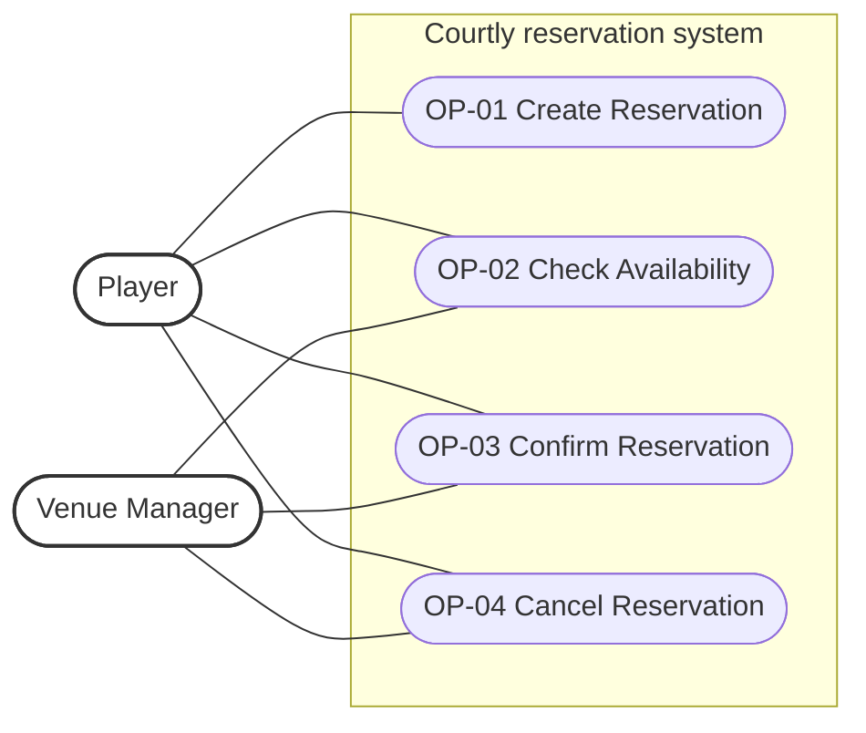
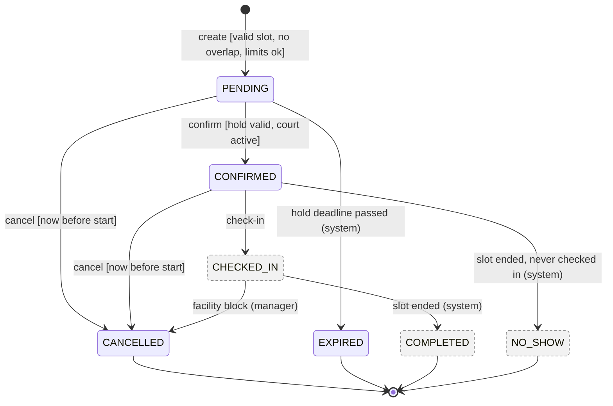
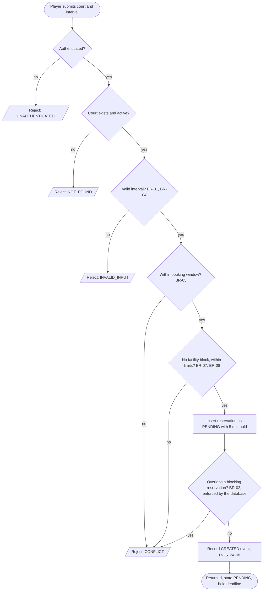
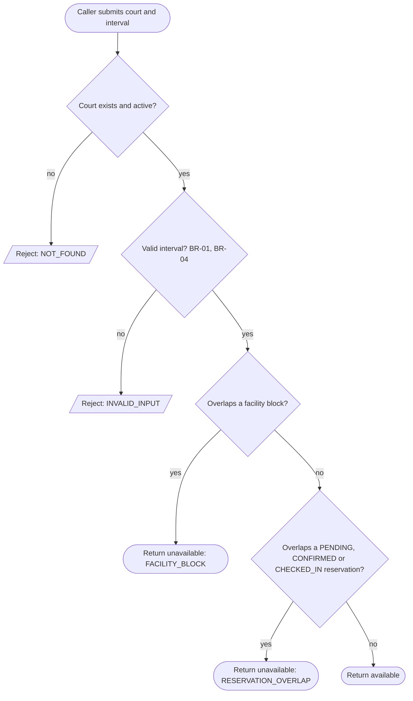
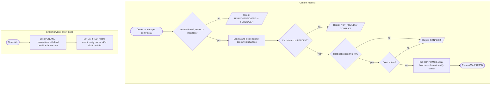
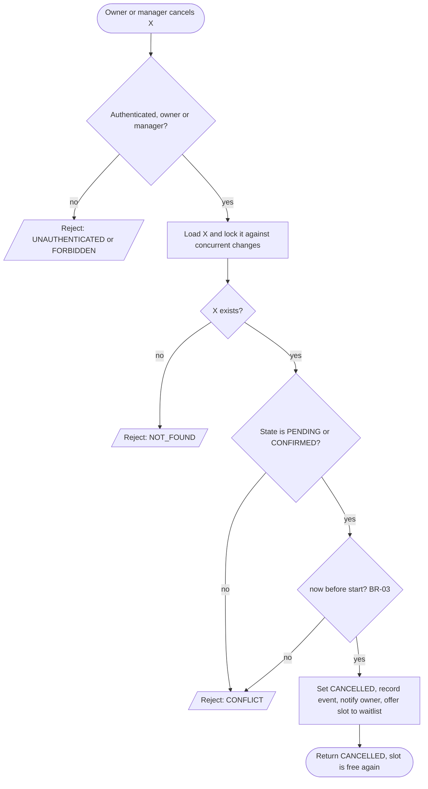

# Specification Baseline v0.1 — Courtly (C02)

| | |
|---|---|
| **Status** | Prepared for team approval — approval is recorded in §11 and is **not yet given** |
| **Scope** | The four minimal operations: Create, Check Availability, Confirm, Cancel Reservation |
| **Domain** | Sports courts of one venue (tennis, volleyball, badminton) — see `intent-and-change.md` |
| **Successor** | `specification.md` (v0.2, approval process). This file is the frozen v0.1 baseline and is not edited after approval. |
| **Ground truth for "what runs"** | `backend/src/reservations/` — this document is the *requirement*; where the two disagreed, §7 and `evidence-and-evolution.md` say which side was wrong |

## 1. Scope, conventions, vocabulary

**In scope:** OP-01 Create, OP-02 Check Availability, OP-03 Confirm, OP-04 Cancel, and the rules they share.
**Out of scope (implemented in the app, deliberately not specified here):** see §9.

| Term | Meaning |
|---|---|
| **Resource** | A *court* (id, name, sport type, indoor flag, `active` flag). Exclusive: one user holds a whole court for an interval (Project Frame, "Assumption"). |
| **Reservation** | One court, one user, one interval `[start, end)`, and a state. |
| **User / Player** | An authenticated account with role `PLAYER`. |
| **Venue Manager** | An authenticated account with role `VENUE_MANAGER`. May act on any reservation for the operations below. |
| **now** | The application server's clock, as a UTC instant. All comparisons in this document are between *instants*; wall-clock text is only used for BR-04 (venue-local opening hours). |
| **Blocking state** | A reservation state in which the reservation occupies its court: `PENDING`, `CONFIRMED`, `CHECKED_IN` (BR-02). |
| **Rejected** | The request has no effect: no reservation is created, no state changes, no notification is sent. |

**Rejection categories** (defined once; operations refer to them by name). They map onto HTTP status codes because the HTTP API is the reproducible interface of the running application:

| Category | HTTP | Used when |
|---|---|---|
| `UNAUTHENTICATED` | 401 | No valid bearer token |
| `FORBIDDEN` | 403 | Caller is neither the reservation's owner nor a Venue Manager |
| `NOT_FOUND` | 404 | Reservation, or court, does not exist — an *inactive* court is reported exactly like an unknown one |
| `INVALID_INPUT` | 422 | Malformed request, or the interval breaks BR-01 / BR-04 |
| `CONFLICT` | 409 | Well-formed request, but a business rule or the reservation's current state forbids it |

When a request violates several rules at once, *which* rejection is reported is unspecified; that it is rejected is specified.

## 2. Reservation states (v0.1)

| State | Meaning | Blocks court? | Terminal? |
|---|---|---|---|
| `PENDING` | A time-limited **hold**: the user has picked a slot and must confirm before the hold deadline (BR-06). Called `DRAFT` in the Project Frame; renamed because it is no longer inert (decision D-01). | yes | no |
| `CONFIRMED` | The system has accepted the reservation as the valid allocation of the court. | yes | no |
| `CANCELLED` | Withdrawn by the owner or a manager under BR-03, or cancelled because the court was closed by a facility block (§9). | no | yes |
| `EXPIRED` | A `PENDING` hold that was not confirmed before its deadline. | no | yes |
| `CHECKED_IN`, `COMPLETED`, `NO_SHOW` | Fulfilment of a confirmed reservation. Exist in the running app, **outside** this baseline (§9). Only their effect on the rules below is specified: `CHECKED_IN` blocks the court; `COMPLETED` and `NO_SHOW` do not. | see left | `COMPLETED`, `NO_SHOW` |

Cancelling never deletes data: the row stays, the state changes, and every transition appends an audit event (`GET /reservations/{id}/history`).

## 3. Domain rules and invariants (defined once)

### BR-01 — Interval semantics
A reservation interval is the half-open range `[start, end)` of instants. Two intervals **overlap** iff `a.start < b.end AND b.start < a.end`. Consequently intervals that only touch (`[10:00,11:00)` and `[11:00,12:00)`) do **not** overlap. A valid interval has `start < end`; `start` must carry a UTC offset (a "naive" local time is invalid input).

### BR-02 — Exclusive Resource invariant
At no committed system state may two reservations in a *blocking state* (`PENDING`, `CONFIRMED`, `CHECKED_IN`) overlap on the same court.
*Difference from the reference example, on purpose:* the reference lets only `CONFIRMED` reservations block. Here a `PENDING` hold blocks as well (decision D-01), so the conflict is detected at **Create**, not at Confirm — a player never fills in a booking that cannot be honoured.

### BR-03 — Cancellation policy
A reservation may be cancelled iff **all** hold:
1. its state is `PENDING` or `CONFIRMED`;
2. `now < start` — strictly before the start instant; at `now == start` cancellation is rejected;
3. the caller is its owner or a Venue Manager.

Cancelling an already `CANCELLED` (or otherwise non-cancellable) reservation is an explicit rejection (`CONFLICT`), **not** an idempotent success (decision D-03). A reservation whose slot has started can no longer be cancelled — this closes the loophole of cancelling during the slot to avoid a no-show mark. Venue-side closure of a court is handled by a facility block (§9), not by OP-04.

### BR-04 — Slot shape (domain-specific rule from C01)
A reservation lasts **60, 90 or 120 minutes**, starts on a full or half hour (`:00`/`:30`, in venue-local time), and lies entirely within the venue's opening hours **07:00–22:00 Europe/Prague** on the local day it starts. The check is done in venue-local time, never on the UTC wall clock (known pitfall #1). Violations are `INVALID_INPUT`.

### BR-05 — Booking window
A new reservation must satisfy `now + 15 min ≤ start ≤ now + 14 days`. Outside this window Create is `CONFLICT`.

### BR-06 — Hold
A `PENDING` reservation carries a hold deadline `created_at + 5 minutes`. A hold is **expired** iff `hold_deadline < now` (strict). An expired hold can no longer be confirmed. The system moves every expired, still-`PENDING` reservation to `EXPIRED` (which releases the court) no later than one background cycle (currently 30 s) after the deadline (assumptions A-01, A-02).

### BR-07 — Per-user limits (preconditions of Create)
- **Active limit:** a `PLAYER` may own at most **3** reservations in blocking states at once (a Venue Manager: 1000, i.e. effectively unlimited).
- **No-show pause:** a user with **3 or more** `NO_SHOW` reservations whose start lies within the last **30 days** cannot create new reservations.

### BR-08 — Facility blocks
A Venue Manager can close a court for an interval (a *facility block*, same `[start,end)` semantics). A new reservation overlapping a block is rejected, and availability reports the interval unavailable.

### BR-09 — Lifecycle (allowed transitions, single definition)
The only legal transitions in v0.1 are those in the diagram of §5.2 and the table below. Any other requested transition is `CONFLICT`. `CANCELLED`, `EXPIRED`, `COMPLETED` and `NO_SHOW` are **absorbing**: once entered, the state never changes again.

| From | To | Caused by | Guard |
|---|---|---|---|
| — | `PENDING` | OP-01 Create | BR-01, 04, 05, 07, 08 satisfied, no overlap (BR-02) |
| `PENDING` | `CONFIRMED` | OP-03 Confirm | hold not expired, court active |
| `PENDING` | `CANCELLED` | OP-04 Cancel | BR-03 |
| `PENDING` | `EXPIRED` | system, BR-06 | `hold_deadline < now` |
| `CONFIRMED` | `CANCELLED` | OP-04 Cancel | BR-03 |
| `CONFIRMED` | `CHECKED_IN` / `NO_SHOW` | outside baseline (§9) | — |
| `CHECKED_IN` | `COMPLETED` / `CANCELLED` | outside baseline (§9; `CANCELLED` only by a facility block) | — |

### BR-10 — Authorization
Create and Confirm/Cancel require authentication. Confirm and Cancel may be performed by the reservation's owner or by any Venue Manager. Check Availability requires no authentication (it exposes no personal data).

## 4. Operations

### OP-01 — Create Reservation

**Goal / user value:** A player takes a slot on a court immediately and privately, without phoning the venue; the slot is held while they finish confirming.
**Trigger:** An authenticated User submits court, `start_time`, `end_time`. Interface: `POST /reservations`.

**Observable requirements**
- **REQ-01** — The system shall create exactly one `PENDING` reservation, owned by the caller, for an existing *active* court when the interval satisfies BR-01, BR-04 and BR-05, does not overlap any blocking reservation of that court (BR-02) or facility block (BR-08), and the caller is within the limits of BR-07. Any other request is rejected and creates nothing.
- **REQ-02** — When several Create requests for overlapping intervals of the same court are processed concurrently, **at most one** shall succeed; the others are rejected with `CONFLICT`. BR-02 holds after every commit, regardless of interleaving.

**Preconditions:** caller authenticated; court exists and is active; interval valid (BR-01, BR-04); within booking window (BR-05); no facility block overlap (BR-08); within limits (BR-07).
**Success postcondition:** one new reservation exists with `state = PENDING`, `user = caller`, `hold_deadline = now + 5 min`; it blocks the court for its interval (BR-02); an audit event `CREATED` exists; the owner has an in-app notification "Slot held". The response carries the reservation id and current state.
**State change:** `[none] → PENDING`.
**Referenced rules:** BR-01, BR-02, BR-04, BR-05, BR-06, BR-07, BR-08, BR-10.

**Main success scenario**
1. Player submits court and interval.
2. System validates authentication, court, interval shape, booking window, facility blocks and limits.
3. System creates the reservation in `PENDING` with a 5-minute hold; the database refuses the insert if a blocking reservation overlaps (BR-02).
4. System records the audit event and notification, and returns the reservation id, state and hold deadline.

**Alternative / failure outcomes** (all *rejected*, nothing created)
- no/invalid token → `UNAUTHENTICATED`;
- unknown or inactive court → `NOT_FOUND`;
- `start ≥ end`, naive `start`/`end`, duration not 60/90/120 min, start not on `:00`/`:30`, or outside 07:00–22:00 Prague → `INVALID_INPUT`;
- `start < now + 15 min` or `start > now + 14 days` → `CONFLICT`;
- overlaps a facility block, or a `PENDING`/`CONFIRMED`/`CHECKED_IN` reservation → `CONFLICT`;
- user already holds 3 blocking reservations, or is under the no-show pause → `CONFLICT`.

**Verification examples**
| ID | Setup → action | Expected |
|---|---|---|
| VE-01.1 | court C active; user U; `[18:00,19:00)` three days ahead | one `PENDING` reservation for U; hold ≈ now+5 min; C is now unavailable for that interval |
| VE-01.2 | `start == end` | `INVALID_INPUT`; zero reservations |
| VE-01.3 | unknown court id | `NOT_FOUND`; zero reservations |
| VE-01.4 | no bearer token | `UNAUTHENTICATED`; zero reservations |
| VE-01.5 | `[21:00,22:00)` ok; `[21:30,22:30)`, `[06:30,07:30)`, 45 min, start `:15` | first created; others `INVALID_INPUT` (opening-hours and shape boundaries) |
| VE-01.6 | `start = now + 14 min` / `now + 15 min` / `now + 14 d` / `now + 14 d + 1 s` | `CONFLICT` / accepted / accepted / `CONFLICT` (boundaries of BR-05, tested with an injected clock) |
| VE-01.7 | existing `[18:00,19:00)`; new `[18:30,19:30)` / `[19:00,20:00)` | `CONFLICT` / created (touching intervals do not overlap, BR-01) |
| VE-01.8 | user already has 3 blocking reservations | 4th → `CONFLICT` |
| VE-01.9 | 8 users create the *same* slot at the same moment | exactly one succeeds, seven `CONFLICT`; exactly one blocking reservation exists (REQ-02) |

**Rationale:** Creation records the user's intent *and* reserves the slot briefly, so that two players cannot both spend the booking flow on one slot and only one learn at the end that it was taken (Project Frame, purpose; decision D-01).
**Assumption / TBD:** hold length 5 min is a product choice without external source (A-01).

### OP-02 — Check Availability

**Goal / user value:** Anyone can tell whether a court is free for a given interval before trying to book it.
**Trigger:** A caller (authenticated or not) asks about court C and interval I. Interface: `GET /courts/{court_id}/availability/check?start_time=…&end_time=…`.

**Observable requirement**
- **REQ-03** — For an existing, active court and a valid interval (BR-01, BR-04), the system shall report the interval **unavailable** iff it overlaps (BR-01) a reservation of that court in a blocking state, or a facility block of that court; otherwise **available**. The report contains `available` and, when unavailable, the cause (`RESERVATION_OVERLAP` or `FACILITY_BLOCK`). The operation changes no state. The answer is a snapshot: it does not reserve anything, and only OP-01 guarantees an allocation.

**Preconditions:** court exists and is active; interval valid (shape only — the booking window and per-user limits of Create are *user-specific* rules and are deliberately **not** part of availability).
**Success postcondition:** the verdict is returned; no reservation, hold or event is created or modified.
**State change:** none.
**Referenced rules:** BR-01, BR-02, BR-04, BR-08.

**Main success scenario**
1. Caller submits court and interval.
2. System validates court and interval shape.
3. System looks for a blocking reservation or facility block overlapping the interval.
4. System returns `available = true`, or `available = false` with the cause.

**Alternative / failure outcomes**
- unknown or inactive court → `NOT_FOUND`;
- invalid interval → `INVALID_INPUT`.

**Verification examples** (existing `CONFIRMED [10:00,11:00)` on court C)
| ID | Query | Expected |
|---|---|---|
| VE-02.1 | `[09:00,10:00)` | `available` (touches the start) |
| VE-02.2 | `[10:30,11:30)` | unavailable, `RESERVATION_OVERLAP` |
| VE-02.3 | `[11:00,12:00)` | `available` (touches the end) |
| VE-02.4 | same interval held by a `PENDING` reservation | unavailable; after that reservation is `CANCELLED` or `EXPIRED` → `available` |
| VE-02.5 | interval inside a facility block | unavailable, `FACILITY_BLOCK` |
| VE-02.6 | unknown court / `start == end` | `NOT_FOUND` / `INVALID_INPUT`; reservation table unchanged |

**Rationale:** The same set of blocking states must decide Create, Confirm and Availability; defining it once (BR-02) prevents the three from disagreeing.
**Assumption / TBD:** none.

### OP-03 — Confirm Reservation

**Goal / user value:** The player's held slot becomes the accepted allocation of the court.
**Trigger:** The owner (or a Venue Manager) requests confirmation of reservation X. Interface: `POST /reservations/{id}/confirm`.

**Observable requirements**
- **REQ-04** — The system shall confirm a reservation only if it is `PENDING`, its hold is not expired (BR-06) and its court is active; the caller must be its owner or a Venue Manager. Confirming does not change what the reservation blocks, so BR-02 remains true.
- **REQ-05** — A `PENDING` reservation whose hold expired shall become `EXPIRED` and stop blocking its court no later than one background cycle after the deadline (BR-06); until then it must not be confirmable.
- **REQ-07** — Concurrent state-changing requests on the *same* reservation (Confirm, Cancel, hold expiry) shall take effect one after the other in some order; the later one sees the earlier one's result and is evaluated against it. A terminal state is never overwritten (BR-09).

**Preconditions:** reservation exists; `state = PENDING`; `hold_deadline ≥ now`; court active; caller is owner or manager.
**Success postcondition:** `state = CONFIRMED`; the hold deadline is cleared; the reservation still blocks its court; audit event `CONFIRMED`; the owner has an in-app notification "Reservation confirmed"; BR-02 holds.
**State change:** `PENDING → CONFIRMED`.
**Referenced rules:** BR-02, BR-06, BR-09, BR-10.

**Main success scenario**
1. Player asks to confirm reservation X.
2. System loads X and serialises against other changes to X.
3. System checks ownership, that X is `PENDING`, that the hold is valid and that the court is active.
4. System sets `CONFIRMED`, clears the hold deadline, records the event and notification.
5. System returns the reservation with `state = CONFIRMED`.

**Alternative / failure outcomes** (state unchanged)
- unknown reservation → `NOT_FOUND`; not owner and not manager → `FORBIDDEN`; no token → `UNAUTHENTICATED`;
- reservation not `PENDING` (already `CONFIRMED`, `CANCELLED`, `EXPIRED`, …) → `CONFLICT` — repeating a Confirm is **not** an idempotent success (decision D-06);
- hold expired → `CONFLICT`; the reservation stays `PENDING` until the system expires it, and is then `EXPIRED`;
- court has been deactivated → `CONFLICT`; the reservation stays `PENDING`;
- *Confirm cannot fail because of an overlap*: the hold already excludes every overlapping blocking reservation (BR-02). The database constraint remains the backstop; if it ever fired the answer would be `CONFLICT` (decision D-08).
- **Confirm races Cancel:** either order is legal; Confirm-then-Cancel ends `CANCELLED` (both succeed), Cancel-then-Confirm ends `CANCELLED` (Confirm is `CONFLICT`). The final state is always `CANCELLED`, never `CONFIRMED` (REQ-07).
- **Confirm races hold expiry:** the deadline decides — before it, Confirm wins and the reservation is never expired; after it, Confirm is `CONFLICT`.

**Verification examples**
| ID | Setup → action | Expected |
|---|---|---|
| VE-03.1 | `PENDING`, owner confirms | `CONFIRMED`, hold cleared, court still unavailable, event + notification recorded |
| VE-03.2 | confirm a `CONFIRMED` / `CANCELLED` reservation | `CONFLICT`, state unchanged |
| VE-03.3 | hold deadline in the past, sweep not yet run → confirm | `CONFLICT`, still `PENDING`; after one sweep → `EXPIRED` and the interval is `available` (VE-03.7) |
| VE-03.4 | court deactivated after Create → confirm | `CONFLICT`, still `PENDING` |
| VE-03.5 | another player's reservation → confirm | `FORBIDDEN`, unchanged; a Venue Manager may confirm it |
| VE-03.6 | Confirm and Cancel sent concurrently, repeated 20× | final state `CANCELLED` every time; audit trail never shows a transition out of `CANCELLED` |
| VE-03.7 | two holds: one expired, one valid; run the expiry sweep | expired → `EXPIRED` (+ notification, court free); valid one untouched |

**Rationale:** Confirmation is the player's explicit commitment; the deadline keeps abandoned holds from blocking scarce slots.
**Assumption / TBD:** A-01, A-02 (values of hold length and sweep latency).

### OP-04 — Cancel Reservation

**Goal / user value:** An eligible reservation can be withdrawn and stops blocking the court, so someone else can book it.
**Trigger:** The owner (or a Venue Manager) requests cancellation of reservation X. Interface: `POST /reservations/{id}/cancel`.

**Observable requirement**
- **REQ-06** — The system shall cancel a reservation iff BR-03 holds (state `PENDING` or `CONFIRMED`, `now < start`, caller owner or manager); the cancelled reservation no longer blocks its court and is retained with `state = CANCELLED`.

**Preconditions:** reservation exists; `state ∈ {PENDING, CONFIRMED}`; `now < start`; caller is owner or manager.
**Success postcondition:** `state = CANCELLED` (row retained); the interval is available again (OP-02); audit event `CANCELLED`; the owner has an in-app notification; a waitlisted player for exactly that slot, if any, is offered it (§9).
**State change:** `PENDING → CANCELLED`, `CONFIRMED → CANCELLED`.
**Referenced rules:** BR-02, BR-03, BR-09, BR-10.

**Main success scenario**
1. Player asks to cancel reservation X.
2. System loads X and serialises against other changes to X.
3. System checks ownership, state and `now < start`.
4. System sets `CANCELLED`, records the event and notification.
5. System returns the reservation with `state = CANCELLED`.

**Alternative / failure outcomes** (state unchanged)
- unknown reservation → `NOT_FOUND`; not owner/manager → `FORBIDDEN`; no token → `UNAUTHENTICATED`;
- already `CANCELLED` (or `EXPIRED`, `CHECKED_IN`, `COMPLETED`, `NO_SHOW`) → `CONFLICT` (explicit rejection, D-03);
- `now ≥ start` → `CONFLICT`;
- Cancel races Confirm or hold expiry → see OP-03 (REQ-07); Cancel-vs-expiry: whichever is applied first wins and the second is rejected/skipped.

**Verification examples**
| ID | Setup → action | Expected |
|---|---|---|
| VE-04.1 | `PENDING`, before start | `CANCELLED`; interval `available` |
| VE-04.2 | `CONFIRMED`, before start | `CANCELLED`; interval `available` |
| VE-04.3 | `CONFIRMED` whose start is 1 s in the past | `CONFLICT`, still `CONFIRMED`; `CHECKED_IN` → `CONFLICT` |
| VE-04.4 | boundary: `now == start` vs `now == start − 1 µs` | rejected / allowed (injected clock) |
| VE-04.5 | cancel an already `CANCELLED` reservation | `CONFLICT` |
| VE-04.6 | another player's reservation | `FORBIDDEN`; a Venue Manager may cancel it |
| VE-04.7 | cancel, then Create the same interval | second Create succeeds (slot was released) |

**Rationale:** Freeing a slot early is the value of cancelling; forbidding it after the start gives the rule a checkable time boundary and keeps the no-show statistics honest (D-03).
**Assumption / TBD:** A-03 (the app server's clock is the single time source).

## 5. Behaviour views

### 5.1 Use case diagram — actors and goals

The Venue Manager's goals are the same operations, exercised on *any* reservation (BR-10). There is **no external supporting actor**: notifications are in-app only (D-07), so the Project Frame's "Notification Service" does not exist as a system boundary yet (U-01). Check Availability also works for an unauthenticated visitor.

### 5.2 State diagram — life cycle of a Reservation

Dashed states and the transitions touching them are the fulfilment part of the life cycle: they exist in the running app but are not one of the four baseline operations (§9). States that block the court: `PENDING`, `CONFIRMED`, `CHECKED_IN`.

### 5.3 Activity diagrams

**OP-01 Create Reservation**

**OP-02 Check Availability**

**OP-03 Confirm Reservation, including the hold-expiry sweep**

**OP-04 Cancel Reservation**

## 6. Requirement acceptance review

Every accepted requirement was put through the nine questions of the assignment. Feasibility and consistency were checked jointly across all requirements in §7, so they appear as one column here.

| REQ | Meaning made precise (boundaries, terms) | Need — why it exists | Observable? (behaviour, not implementation) | Verified by | State / time | Concurrency | Uncertainty |
|---|---|---|---|---|---|---|---|
| **REQ-01** Create | "Valid" = BR-01/04/05; "blocking" = BR-02; "rejected creates nothing" | Core purpose: book without phoning the venue | Outcome stated as reservations that exist/not exist; hold length is the only number | VE-01.1 – 01.8 | depends on `now` (BR-05) and on existing reservations; boundary = `[start,end)` | see REQ-02 | hold length A-01 |
| **REQ-02** Create races | "At most one" among overlapping intervals of one court | Q-pressure of the Project Frame: Friday 18:00 rush | Outcome only (count of successes); *how* is C03 (ADR-001 already fixes the mechanism) | VE-01.9 + DB test from C01 | order of arrival is irrelevant | this *is* the concurrency requirement | none |
| **REQ-03** Availability | "Unavailable" = overlaps a blocking reservation or facility block; user rules excluded | Players must see what is free before booking | Verdict + cause; no state change | VE-02.1 – 02.6 | snapshot in time; touching boundaries are free | may be stale by the time Create runs — stated in the requirement | none |
| **REQ-04** Confirm | Preconditions enumerated; "expired" defined by BR-06 | Explicit player commitment | Result state + which conditions reject | VE-03.1 – 03.5 | hold deadline is a time condition; strict `<` | serialised via REQ-07 | A-01 |
| **REQ-05** Hold expiry | Deadline `created_at + 5 min`; release within one cycle | Abandoned holds must not block scarce slots | Court becomes available again; state `EXPIRED` | VE-03.3, VE-03.7 | time-driven, asynchronous by ≤ 1 cycle | Confirm/Cancel/expiry race → REQ-07 | 5 min: A-01; ≤ 30 s: A-02 |
| **REQ-06** Cancel | BR-03 (state, `now < start`, actor) | Free a slot early; policy must be checkable | Result state + slot free | VE-04.1 – 05.7 | strict `now < start`; time source A-03 | Cancel vs Confirm/expiry → REQ-07 | time source A-03 |
| **REQ-07** Serialisation | "One after the other in some order"; terminal states absorbing | Race outcomes must be defined, not accidental | Outcome: final state well-defined (Confirm‖Cancel → `CANCELLED`) | VE-03.6 | — | this *is* the requirement | none |

*Not accepted as requirements (rejected during the review):* "use PostgreSQL" / "use an exclusion constraint" (a design decision — ADR-001, not a requirement); "reject invalid requests quickly" (no measurable threshold, would be invented precision); "send an e-mail on confirmation" (needs an external boundary that does not exist — U-01).

## 7. Consistency review

The four operations, the rules and the three diagrams were read against each other. Each row records what was checked and what was found; "found" entries are real discrepancies between the *documents and the running app* that were resolved before this baseline was frozen (details and commits in `evidence-and-evolution.md`).

| Check | Result |
|---|---|
| Create vs. Confirm | Reference assumed Create does not allocate and Confirm checks overlap. Here Create allocates (hold), so Confirm cannot fail on overlap; REQ-03/04 of the reference were rewritten accordingly (D-01, D-08). Consistent. |
| Availability vs. Confirm/Create | Both use the one set of blocking states of BR-02. **Found:** the app's only availability endpoint was a day view listing busy slots; it gave no interval verdict and ignored facility blocks. Resolved: verdict endpoint added (OP-02); the day view is a UI read model outside the baseline (§9, gap G-01). |
| Cancel vs. state diagram | Text allows cancel from `PENDING`/`CONFIRMED` only, before start; the diagram has exactly those two edges from operations. **Found:** the app allowed cancelling at any time, even after the slot started, and (via the UI) from `CHECKED_IN`. Resolved in the implementation (decision D-03). |
| Confirm vs. hold rule | **Found:** the app confirmed a hold whose deadline had passed but had not yet been swept, and confirmed on a deactivated court. The specification wins (REQ-04); implementation fixed. |
| Concurrency vs. state model | **Found:** two concurrent requests on the same reservation could overwrite each other (e.g. a late Confirm re-opening a just-cancelled reservation). REQ-07 added; implementation fixed. |
| Meaning of intervals | BR-01 half-open everywhere: Create, Availability, facility blocks, all verification examples use touching intervals (VE-01.7, VE-02.1, VE-02.3). |
| Use case diagram vs. text | Every OP has an actor and a goal in §5.1; every actor goal in §5.1 has an OP. No orphan. |
| State diagram vs. text | Every operation-caused transition in §5.2 appears in BR-09 and in exactly one OP; the dashed part is declared out of scope, not silently dropped. |
| Requirement vs. design decision | Implementation choices (exclusion constraint, row locks, worker) live in ADR-001 / code, not in REQs (§6). |
| Uncertainty vs. invented precision | Every number without an external source is listed as an assumption (§8) instead of being presented as a fact. |
| Project Frame vs. this baseline | **Found:** the Frame and ADR-001 say `DRAFT` does not block and only `CONFIRMED` is excluded; the code (deliberately) blocks with `PENDING` holds. The Frame's *decisions* stay valid; this baseline supersedes that one sentence (D-01) and ADR-001 gets an addendum. |

## 8. Decisions, assumptions, unknowns

### Decisions the team must be able to defend (made explicit; none was left to an AI default)
| ID | Decision | Alternative rejected | Why |
|---|---|---|---|
| D-01 | Create takes a **blocking, time-limited hold** (`PENDING`); overlap is detected at Create | Non-blocking `DRAFT`; overlap checked only at Confirm (the assignment's reference example) | Players never complete a flow for a slot that is already gone; matches the deliberately built hold behaviour of the app and its UI. Cost: an abandoned hold blocks a slot for up to 5 min + one sweep cycle. |
| D-02 | Blocking states = `PENDING`, `CONFIRMED`, `CHECKED_IN` | `CONFIRMED` only | Follows from D-01; a checked-in game is still occupying the court. |
| D-03 | Cancel: only `PENDING`/`CONFIRMED`, strictly before start, second Cancel is rejected | Cancel until check-in / at any time; idempotent second Cancel | The boundary must be checkable; prevents dodging a no-show by cancelling mid-slot; explicit rejection tells the user the truth about the current state. |
| D-04 | Concurrent Confirm‖Cancel always ends `CANCELLED` | Either outcome, unspecified | Cancel is an abort: it must never be undone by a racing Confirm. |
| D-05 | Availability answers *occupancy* only; public; inactive court → `NOT_FOUND` | Include booking-window/limits in the verdict; expose inactive courts | Occupancy is the same for everyone and safe to publish; user rules belong to Create. |
| D-06 | Repeated Confirm is rejected | Idempotent success | Same reasoning as D-03; a repeated request usually signals a client that is out of sync. |
| D-07 | Notifications are in-app only | E-mail via an external service (Project Frame boundary) | No such integration exists; deferring it keeps the system boundary honest (U-01). |
| D-08 | Confirm does not re-check overlap | Re-check for defence in depth | It cannot fail (D-01); the constraint is the backstop. |
| D-09 | A Venue Manager may confirm and cancel any reservation | Owner-only | Project Frame: manager "can cancel any reservation"; support scenarios. |

### Assumptions
| ID | Assumption | Note |
|---|---|---|
| A-01 | Hold length is 5 minutes | Product value, no external source; tunable (`rules.HOLD_MINUTES`). |
| A-02 | An expired hold is released within one background cycle (currently 30 s) | Consequence of the in-process worker (`worker.TICK_SECONDS`); not a business requirement. |
| A-03 | The application server's clock is the single time source; skew against the database is ignored | Acceptable for one venue and one server. |
| A-04 | One venue, one time zone (Europe/Prague) | Project Frame. |

### Unknowns
| ID | Unknown | Resolution |
|---|---|---|
| U-01 | Should players get an e-mail (external Notification Service)? | Open; only in-app notifications exist. |
| U-02 | *Is confirmation automatic, or does it need venue-manager approval?* (Project Frame, "Unknown") | Answered by the change in `specification.md` (v0.2). Baseline v0.1: automatic. |

## 9. Outside this baseline

Implemented in the running app, not specified here (they neither add nor change the four operations, except where noted): check-in, completion and no-show handling (they produce `CHECKED_IN`/`COMPLETED`/`NO_SHOW` and feed BR-07); facility blocks (they cancel overlapping reservations and feed BR-08); waitlist for a taken slot (offered after a Cancel/expiry, and it books a slot directly); rescheduling; recurring series; guests, join requests and cost split; reviews, favourites and achievements; calendar export; admin reports; the day-view availability read model (**G-01:** it ignores facility blocks); the UI and i18n.

## 10. Verification traceability

Every `VE-*` above is executable in `backend/tests/test_spec_baseline.py` against a real PostgreSQL (the exclusion constraint cannot be mocked). Test names start with the VE id. The live run of all four operations against the running server is recorded in `evidence-and-evolution.md`.

## 11. Approval

Specification Baseline v0.1 becomes **approved by the team** when every member below has reviewed §3–§8, in particular the decision register D-01…D-09, and ticks their line (a review approval of the pull request that introduces this file counts). Until then the status in the header stays "Prepared for team approval".

- [ ] Adam Vrána
- [ ] Marek Tyl
- [ ] Josef Glogar
- [ ] Adam Mikoláš

Date of approval: _______________
