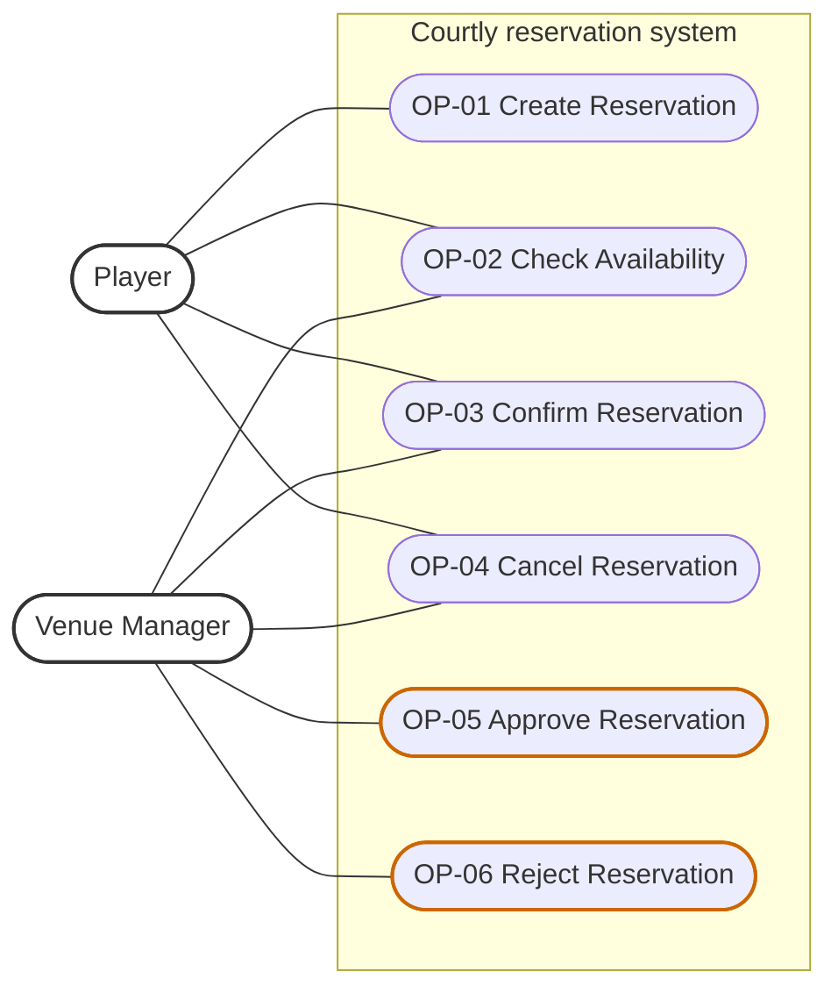
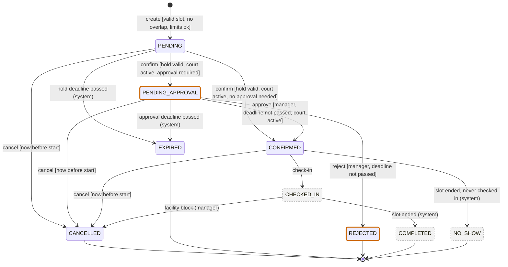
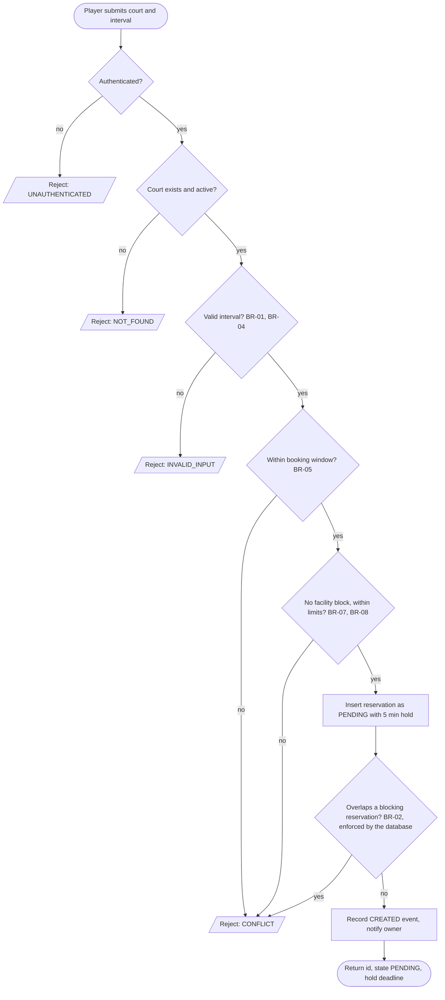
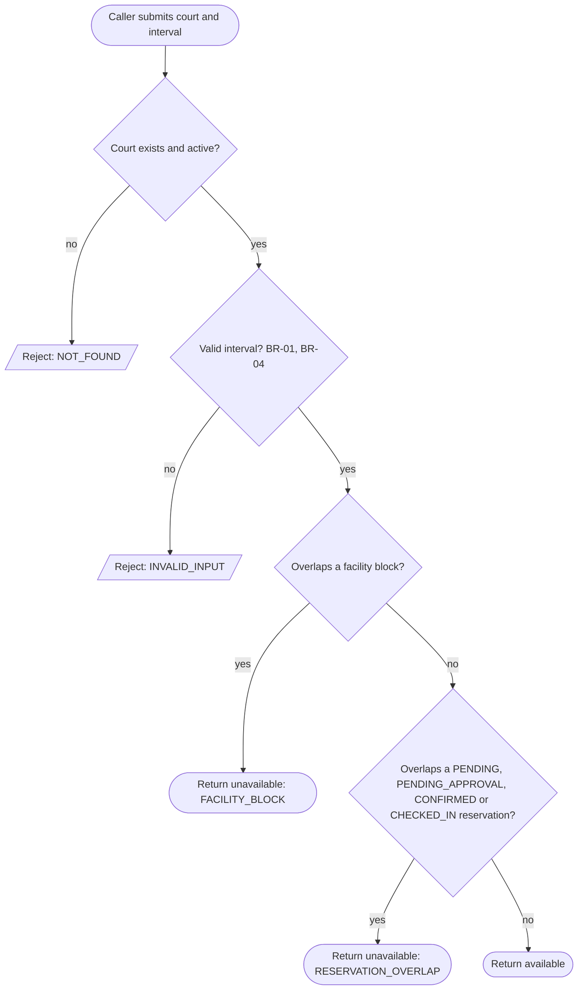
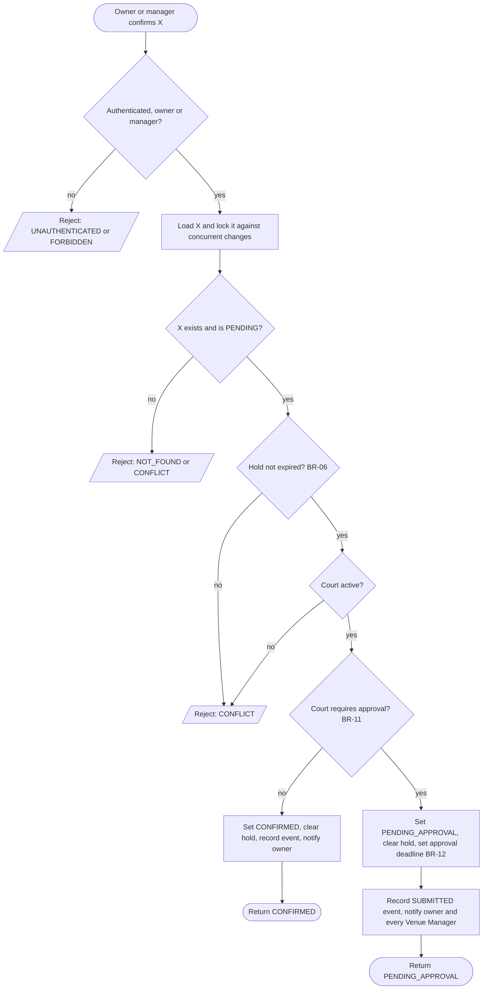
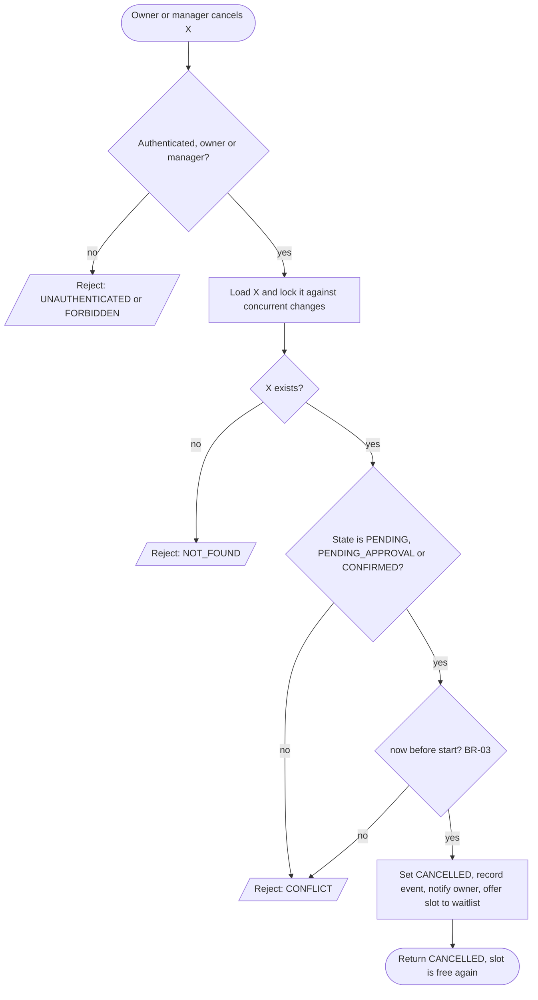
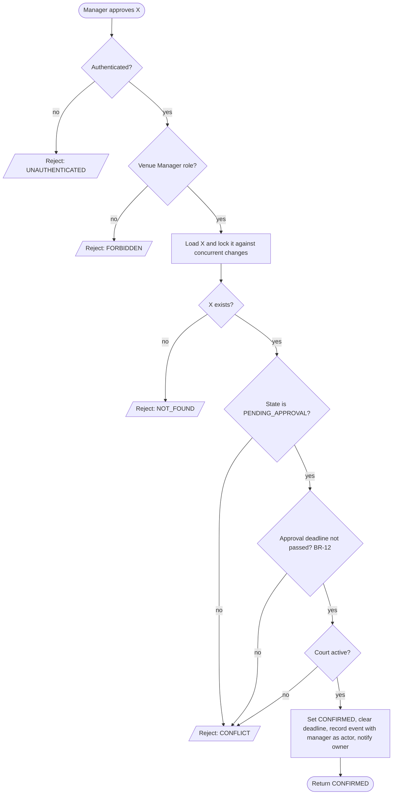
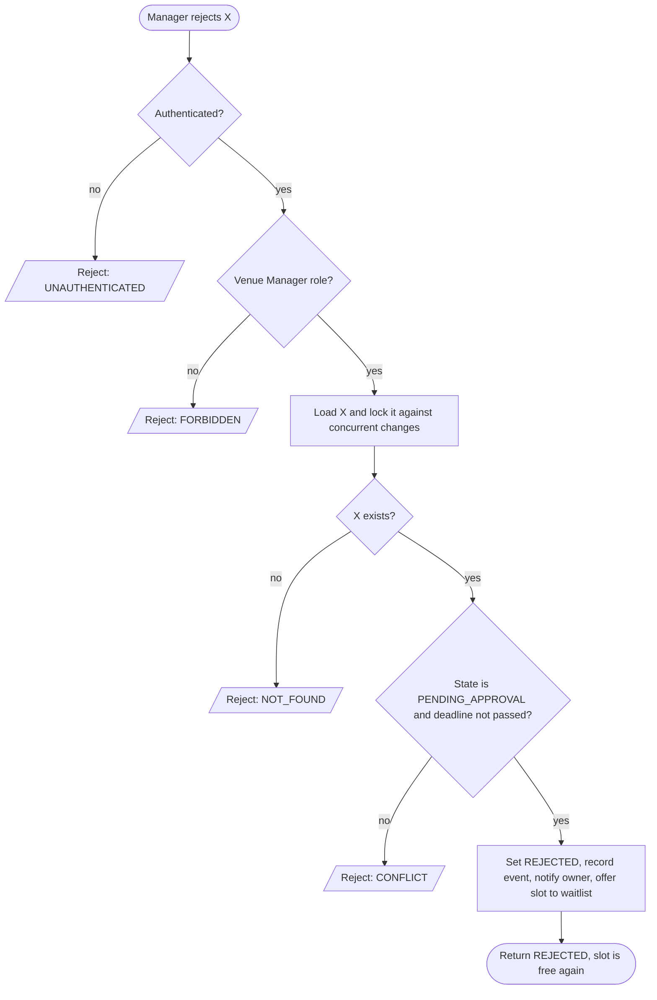
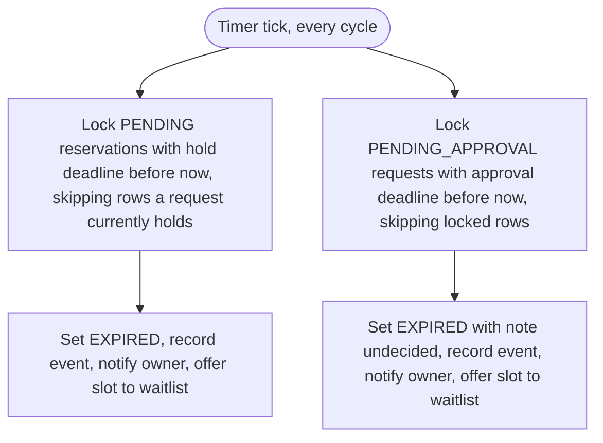

# Specification Baseline v0.2 — Courtly (C02, approval process)

| | |
|---|---|
| **Status** | Prepared for team approval — approval is recorded in §11 and is **not yet given** |
| **Version** | v0.2 = baseline v0.1 (`specification-v0.1.md`, frozen) + change C02 "approval process" |
| **Scope** | OP-01 Create, OP-02 Check Availability, OP-03 Confirm, OP-04 Cancel (v0.1) + OP-05 Approve, OP-06 Reject (new) |
| **Reasoning behind the change** | `change-c02-impact.md` — written *before* this file; its §4 is the consolidated "Dopad změny C02" block |
| **Ground truth for "what runs"** | `backend/src/reservations/` — this document is the *requirement* |

Every part below is marked **Unchanged**, **Changed** or **New** relative to v0.1, so what did *not* move is as explicit as what did. Unchanged parts are repeated in full so this file can be read on its own.

## 1. Scope, conventions, vocabulary — *Changed (two terms added)*

**Out of scope:** see §9.

| Term | Meaning |
|---|---|
| **Resource** | A *court* (id, name, sport type, indoor flag, `active` flag, **`requires_approval` flag — new**). Exclusive: one user holds a whole court for an interval. |
| **Approval-required Resource** *(new)* | A court with `requires_approval = true`. A Venue Manager sets the flag through the existing court administration (not one of the specified operations). |
| **Reservation** | One court, one user, one interval `[start, end)`, and a state. |
| **User / Player** | An authenticated account with role `PLAYER`. |
| **Venue Manager** | An authenticated account with role `VENUE_MANAGER`. May act on any reservation for OP-03/OP-04 and is the **only** role that may perform OP-05/OP-06 (the *approver*). |
| **now** | The application server's clock, as a UTC instant. Comparisons are between *instants*; wall-clock text is only used for BR-04. |
| **Blocking state** | A state in which a reservation occupies its court: `PENDING`, **`PENDING_APPROVAL` (new)**, `CONFIRMED`, `CHECKED_IN` (BR-02). |
| **Rejected** *(request outcome)* | The request has no effect: nothing is created, no state changes, no notification is sent. (Not to be confused with the *state* `REJECTED`.) |

**Rejection categories** — *Unchanged.* They map onto HTTP status codes because the HTTP API is the reproducible interface of the running app.

| Category | HTTP | Used when |
|---|---|---|
| `UNAUTHENTICATED` | 401 | No valid bearer token |
| `FORBIDDEN` | 403 | Caller lacks the required standing: not owner/manager (OP-03, OP-04), not a Venue Manager (OP-05, OP-06) |
| `NOT_FOUND` | 404 | Reservation, or court, does not exist — an *inactive* court is reported exactly like an unknown one |
| `INVALID_INPUT` | 422 | Malformed request, or the interval breaks BR-01 / BR-04 |
| `CONFLICT` | 409 | Well-formed request, but a business rule or the reservation's current state forbids it |

When a request violates several rules at once, *which* rejection is reported is unspecified; that it is rejected is specified.

## 2. Reservation states — *Changed (two states added)*

| State | Meaning | Blocks court? | Terminal? |
|---|---|---|---|
| `PENDING` | A time-limited **hold** awaiting the player's Confirm (BR-06). *Unchanged.* | yes | no |
| `PENDING_APPROVAL` *(new)* | The player has submitted the reservation and a Venue Manager has not decided yet. It has an **approval deadline** (BR-12). Reached only from `PENDING`, only on an approval-required Resource. | yes | no |
| `CONFIRMED` | The accepted allocation of the court. On an approval-required Resource, reachable only through Approve (BR-11). | yes | no |
| `REJECTED` *(new)* | A Venue Manager declined the request. | no | yes |
| `CANCELLED` | Withdrawn under BR-03, or cancelled because a facility block closed the court (§9). | no | yes |
| `EXPIRED` *(meaning widened)* | Nobody acted in time: an unconfirmed `PENDING` hold (BR-06) **or** an undecided `PENDING_APPROVAL` request (BR-12). The audit note says which. | no | yes |
| `CHECKED_IN`, `COMPLETED`, `NO_SHOW` | Fulfilment of a confirmed reservation; outside this baseline (§9). `CHECKED_IN` blocks the court; `COMPLETED`, `NO_SHOW` do not. | see left | `COMPLETED`, `NO_SHOW` |

Cancelling or rejecting never deletes data: the row stays, the state changes, and every transition appends an audit event (`GET /reservations/{id}/history`).

## 3. Domain rules and invariants (defined once)

### BR-01 — Interval semantics — *Unchanged*
A reservation interval is the half-open range `[start, end)` of instants. Two intervals **overlap** iff `a.start < b.end AND b.start < a.end`; touching intervals do **not** overlap. A valid interval has `start < end`; both `start` and `end` must carry a UTC offset.

### BR-02 — Exclusive Resource invariant — *Changed (blocking set +1)*
At no committed system state may two reservations in a *blocking state* (`PENDING`, **`PENDING_APPROVAL`**, `CONFIRMED`, `CHECKED_IN`) overlap on the same court.
A request awaiting approval blocks because otherwise two players could wait on one slot and the second approval would fail after a human decision (`change-c02-impact.md` §2, decision D-13).

### BR-03 — Cancellation policy — *Changed (state added)*
A reservation may be cancelled iff **all** hold:
1. its state is `PENDING`, **`PENDING_APPROVAL`** or `CONFIRMED`;
2. `now < start` — strictly before the start instant;
3. the caller is its owner or a Venue Manager.

Cancelling a reservation in any other state is an explicit rejection (`CONFLICT`), not an idempotent success (D-03). Cancelling a `PENDING_APPROVAL` request withdraws it and releases the slot (D-16).

### BR-04 — Slot shape (domain-specific rule from C01) — *Unchanged*
60, 90 or 120 minutes; start on `:00`/`:30` venue-local; entirely within 07:00–22:00 Europe/Prague on the local day it starts. Checked in venue-local time (known pitfall #1). Violations: `INVALID_INPUT`.

### BR-05 — Booking window — *Unchanged*
`now + 15 min ≤ start ≤ now + 14 days` for a new reservation; otherwise Create is `CONFLICT`.

### BR-06 — Hold — *Unchanged*
A `PENDING` reservation has a hold deadline `created_at + 5 min`. A hold is **expired** iff `hold_deadline < now`. An expired hold cannot be confirmed; the system moves it to `EXPIRED` no later than one background cycle (currently 30 s) after the deadline (A-01, A-02). A hold ends when the reservation leaves `PENDING`.

### BR-07 — Per-user limits (preconditions of Create) — *Changed (counted set +1)*
- **Active limit:** a `PLAYER` may own at most **3** reservations in blocking states — now including `PENDING_APPROVAL` — at once (Venue Manager: 1000).
- **No-show pause:** ≥ 3 `NO_SHOW` reservations starting within the last 30 days block new reservations.

### BR-08 — Facility blocks — *Unchanged*
A Venue Manager can close a court for an interval; a new reservation overlapping a block is rejected and availability reports it unavailable. (A block also cancels overlapping reservations — §9.)

### BR-09 — Lifecycle (allowed transitions, single definition) — *Changed*
The only legal transitions are those below and in the diagram of §5.2; any other is `CONFLICT`. `CANCELLED`, `EXPIRED`, **`REJECTED`**, `COMPLETED`, `NO_SHOW` are **absorbing**: once entered, the state never changes.

| From | To | Caused by | Guard |
|---|---|---|---|
| — | `PENDING` | OP-01 Create | BR-01, 04, 05, 07, 08; no overlap (BR-02) |
| `PENDING` | `CONFIRMED` | OP-03 Confirm | hold not expired; court active; **court does not require approval (BR-11)** |
| `PENDING` | **`PENDING_APPROVAL`** | OP-03 Confirm | hold not expired; court active; **court requires approval** |
| `PENDING` | `CANCELLED` | OP-04 Cancel | BR-03 |
| `PENDING` | `EXPIRED` | system, BR-06 | `hold_deadline < now` |
| **`PENDING_APPROVAL`** | `CONFIRMED` | **OP-05 Approve** | Venue Manager; `approval_deadline ≥ now`; court active |
| **`PENDING_APPROVAL`** | `REJECTED` | **OP-06 Reject** | Venue Manager; `approval_deadline ≥ now` |
| **`PENDING_APPROVAL`** | `CANCELLED` | OP-04 Cancel | BR-03 |
| **`PENDING_APPROVAL`** | `EXPIRED` | system, BR-12 | `approval_deadline < now` |
| `CONFIRMED` | `CANCELLED` | OP-04 Cancel | BR-03 |
| `CONFIRMED` | `CHECKED_IN` / `NO_SHOW` | outside baseline (§9) | — |
| `CHECKED_IN` | `COMPLETED` / `CANCELLED` | outside baseline (§9; `CANCELLED` only by a facility block) | — |

### BR-10 — Authorization — *Changed (Approve/Reject added)*
Create, Confirm, Cancel require authentication; Confirm and Cancel may be performed by the owner or any Venue Manager. **Approve and Reject require the Venue Manager role — the owner as a player cannot decide on their own request.** Check Availability requires no authentication.

### BR-11 — Approval invariant — *New*
For an approval-required Resource, a reservation reaches `CONFIRMED` **only** through Approve (OP-05). No other path — Confirm, waitlist acceptance, rescheduling, a manager confirming on a player's behalf — may produce `CONFIRMED` on such a court.
*Grandfathering:* switching the flag on affects only future Confirms. Existing `CONFIRMED` reservations stay valid; an existing `PENDING` hold is evaluated when it is confirmed; an existing `PENDING_APPROVAL` request stays decidable even if the flag is later switched off.

### BR-12 — Approval deadline — *New*
When a reservation enters `PENDING_APPROVAL` it gets `approval_deadline = min(submission time + 24 h, start)` (assumption A-05: the 24 h is a product value without external source). A request is **expired** iff `approval_deadline < now`. An expired request can be neither approved nor rejected; the system moves it to `EXPIRED`, which releases the court, no later than one background cycle after the deadline (A-02). The deadline never exceeds `start`, so a request can never be decided after the slot began.

## 4. Operations

### OP-01 — Create Reservation — *Unchanged (text and behaviour); one counted set widened by BR-07*

**Goal / user value:** A player takes a slot on a court immediately and privately; the slot is held while they finish confirming.
**Trigger:** An authenticated User submits court, `start_time`, `end_time`. Interface: `POST /reservations`.

**Observable requirements**
- **REQ-01** — The system shall create exactly one `PENDING` reservation, owned by the caller, for an existing *active* court when the interval satisfies BR-01, BR-04 and BR-05, does not overlap any blocking reservation (BR-02) or facility block (BR-08), and the caller is within the limits of BR-07. Any other request is rejected and creates nothing.
- **REQ-02** — When several Create requests for overlapping intervals of one court are processed concurrently, **at most one** shall succeed; the others are `CONFLICT`. BR-02 holds after every commit.

**Preconditions:** authenticated; court exists and is active; valid interval; within booking window; no facility block overlap; within limits.
**Success postcondition:** one new reservation with `state = PENDING`, `user = caller`, `hold_deadline = now + 5 min`, blocking the court; audit event `CREATED`; owner notified "Slot held". The response carries id, state and hold deadline.
**State change:** `[none] → PENDING`.
**Referenced rules:** BR-01, 02, 04, 05, 06, 07, 08, 10.

**Main success scenario:** 1. Player submits court and interval. 2. System validates authentication, court, interval, window, blocks, limits. 3. System creates the reservation in `PENDING` with a 5-minute hold; the database refuses the insert if a blocking reservation overlaps. 4. System records the event and notification and returns id, state, hold deadline.

**Alternative / failure outcomes** (all *rejected*): no/invalid token → `UNAUTHENTICATED`; unknown or inactive court → `NOT_FOUND`; `start ≥ end`, naive times, duration not 60/90/120, start not on `:00`/`:30`, outside 07:00–22:00 Prague → `INVALID_INPUT`; outside the booking window, overlapping a facility block or a blocking reservation, or over the BR-07 limits → `CONFLICT`.

**Verification examples:** VE-01.1 – VE-01.9 as in v0.1 (executable in `test_spec_baseline.py`). One added consequence of BR-07's widened set: **VE-01.10** — a player with 2 `CONFIRMED` reservations and 1 `PENDING_APPROVAL` request cannot create a 4th → `CONFLICT`.

**Rationale:** as v0.1 (D-01). **Assumption / TBD:** A-01.

### OP-02 — Check Availability — *Unchanged (text); meaning follows the widened BR-02*

**Goal / user value:** Anyone can tell whether a court is free for a given interval.
**Trigger:** A caller asks about court C and interval I. Interface: `GET /courts/{court_id}/availability/check?start_time=…&end_time=…`.

**Observable requirement**
- **REQ-03** — For an existing, active court and a valid interval, the system shall report the interval **unavailable** iff it overlaps a reservation of that court in a blocking state, or a facility block; otherwise **available**. The report contains `available` and, when unavailable, the cause (`RESERVATION_OVERLAP`/`FACILITY_BLOCK`). No state changes. The answer is a snapshot; only OP-01 guarantees an allocation.

**Preconditions:** court exists and is active; valid interval (shape only; the booking window and limits are user-specific rules of Create).
**Success postcondition:** verdict returned; nothing created or modified. **State change:** none.
**Referenced rules:** BR-01, 02, 04, 08.

**Main success scenario:** 1. Caller submits court and interval. 2. System validates court and interval. 3. System looks for a blocking reservation or facility block overlapping the interval. 4. System returns `available` or unavailable with cause.

**Alternative / failure outcomes:** unknown or inactive court → `NOT_FOUND`; invalid interval → `INVALID_INPUT`.

**Verification examples:** VE-02.1 – VE-02.6 as in v0.1. **New: VE-02.7** — a `PENDING_APPROVAL` request makes its interval unavailable; once it is `REJECTED`, `EXPIRED` or `CANCELLED` the interval is available again.

### OP-03 — Confirm Reservation — *Changed*

**Goal / user value:** The player's held slot becomes the accepted allocation of the court — **immediately on a normal court; as a request for a manager's decision on an approval-required court.**
**Trigger:** The owner (or a Venue Manager) requests confirmation of reservation X. Interface: `POST /reservations/{id}/confirm` (unchanged).

**Observable requirements**
- **REQ-04** *(changed)* — The system shall accept a Confirm only for a `PENDING` reservation whose hold is not expired and whose court is active, from its owner or a Venue Manager. The outcome depends on the court: on a court that does **not** require approval the reservation becomes `CONFIRMED`; on an **approval-required** court it becomes `PENDING_APPROVAL` and receives an approval deadline (BR-12) — it does not become `CONFIRMED`. In both cases the reservation keeps blocking its court, so BR-02 remains true.
- **REQ-05** — *Unchanged.* An unconfirmed `PENDING` hold whose deadline passed shall become `EXPIRED` and stop blocking within one background cycle; until then it cannot be confirmed.
- **REQ-07** *(changed: list extended)* — Concurrent state-changing requests on the *same* reservation (Confirm, Cancel, **Approve, Reject**, hold expiry, **approval expiry**) shall take effect one after the other in some order; the later one is evaluated against the earlier one's result; a terminal state is never overwritten.

**Preconditions:** reservation exists; `state = PENDING`; `hold_deadline ≥ now`; court active; caller owner or manager.
**Success postcondition:**
- *normal court:* `CONFIRMED`; hold cleared; audit event `CONFIRMED`; owner notified "Reservation confirmed" — exactly as v0.1;
- ***approval-required court (new):*** `PENDING_APPROVAL`; hold cleared; `approval_deadline` set (BR-12); audit event `SUBMITTED`; owner notified "Approval requested"; **every Venue Manager notified** "Approval needed". Still blocking.
**State change:** `PENDING → CONFIRMED` *or* `PENDING → PENDING_APPROVAL`.
**Referenced rules:** BR-02, 06, 09, 10, **11, 12**.

**Main success scenario:** 1. Player asks to confirm X. 2. System loads X and serialises against other changes to X. 3. System checks ownership, that X is `PENDING`, hold valid, court active. 4. System reads the court's `requires_approval`. 5a. *(normal)* System sets `CONFIRMED`. 5b. *(approval-required)* System sets `PENDING_APPROVAL`, computes the approval deadline, notifies the managers. 6. System records event and notifications and returns the reservation with its new state.

**Alternative / failure outcomes** (state unchanged): as v0.1 — unknown reservation `NOT_FOUND`, not owner/manager `FORBIDDEN`, no token `UNAUTHENTICATED`, not `PENDING` `CONFLICT` (repeat is not idempotent, D-06), hold expired `CONFLICT`, court deactivated `CONFLICT`; Confirm cannot fail on overlap (D-08). Races as v0.1 (Confirm‖Cancel → always `CANCELLED`; Confirm vs hold expiry → the deadline decides).

**Verification examples:** VE-03.1 – VE-03.7 as in v0.1 (normal court: unchanged results). **New:**
| ID | Setup → action | Expected |
|---|---|---|
| VE-03.8 | approval-required court; `PENDING` hold; owner confirms | `PENDING_APPROVAL` (**not** `CONFIRMED`); hold cleared; deadline ≈ now + 24 h; slot still unavailable; every manager has a notification; owner has one |
| VE-03.9 | same, but the manager confirms on the player's behalf | still `PENDING_APPROVAL` (manager Confirm is not an approval) |

**Rationale:** Splitting Confirm per Resource keeps the endpoint and OP-01 stable while making the approver's decision the only door to `CONFIRMED` (D-10…D-12). **Assumption / TBD:** A-01, A-02, A-05.

### OP-04 — Cancel Reservation — *Changed (`PENDING_APPROVAL` cancellable)*

**Goal / user value:** An eligible reservation can be withdrawn and stops blocking the court.
**Trigger:** The owner (or a Venue Manager) requests cancellation of X. Interface: `POST /reservations/{id}/cancel`.

**Observable requirement**
- **REQ-06** *(changed)* — The system shall cancel a reservation iff BR-03 holds (state `PENDING`, **`PENDING_APPROVAL`** or `CONFIRMED`; `now < start`; caller owner or manager); the cancelled reservation no longer blocks and is retained as `CANCELLED`.

**Preconditions:** X exists; `state ∈ {PENDING, PENDING_APPROVAL, CONFIRMED}`; `now < start`; caller owner or manager.
**Success postcondition:** `CANCELLED` (row retained); interval available again; audit event `CANCELLED`; owner notified; a waitlisted player for exactly that slot is offered it.
**State change:** `PENDING | PENDING_APPROVAL | CONFIRMED → CANCELLED`. **Referenced rules:** BR-02, 03, 09, 10.

**Main success scenario:** 1. Player asks to cancel X. 2. System loads X and serialises. 3. System checks ownership, state, `now < start`. 4. System sets `CANCELLED`, records event and notification. 5. System returns `CANCELLED`.

**Alternative / failure outcomes** (state unchanged): unknown `NOT_FOUND`; not owner/manager `FORBIDDEN`; no token `UNAUTHENTICATED`; any other state (`CANCELLED`, `EXPIRED`, **`REJECTED`**, `CHECKED_IN`, `COMPLETED`, `NO_SHOW`) `CONFLICT`; `now ≥ start` `CONFLICT`; races → REQ-07.

**Verification examples:** VE-04.1 – VE-04.7 as in v0.1. **New: VE-04.8** — the owner cancels a `PENDING_APPROVAL` request before start → `CANCELLED`, interval available; a later Approve on it is `CONFLICT`.

### OP-05 — Approve Reservation — *New*

**Goal / user value:** A Venue Manager accepts a player's request, turning it into the court's accepted allocation.
**Trigger:** A Venue Manager requests approval of reservation X. Interface: `POST /reservations/{id}/approve`.

**Observable requirements**
- **REQ-08** — The system shall let a Venue Manager approve a reservation only if it is `PENDING_APPROVAL`, its approval deadline has not passed (BR-12) and its court is active; the reservation then becomes `CONFIRMED`. It keeps blocking its court, so BR-02 remains true. Any other caller is `FORBIDDEN`.
- **REQ-10** — An undecided `PENDING_APPROVAL` request whose deadline passed shall become `EXPIRED` and stop blocking within one background cycle; until then it can be neither approved nor rejected. The player is notified.
- **REQ-11** — For an approval-required Resource no reservation shall reach `CONFIRMED` except through this operation (BR-11): Confirm, waitlist acceptance and manager-on-behalf Confirm yield `PENDING_APPROVAL`; a `CONFIRMED` reservation on such a court cannot be rescheduled.

**Preconditions:** X exists; `state = PENDING_APPROVAL`; `approval_deadline ≥ now`; court active; caller has the Venue Manager role.
**Success postcondition:** `state = CONFIRMED`; approval deadline cleared; still blocking; audit event `CONFIRMED` with the approving manager as actor; the owner notified "Reservation approved". BR-02 holds.
**State change:** `PENDING_APPROVAL → CONFIRMED`. **Referenced rules:** BR-02, 09, 10, 11, 12.

**Main success scenario:** 1. Manager opens the pending requests and asks to approve X. 2. System checks the Venue Manager role. 3. System loads X and serialises against other changes to X. 4. System checks state, deadline, court active. 5. System sets `CONFIRMED`, clears the deadline, records event and notification. 6. System returns `CONFIRMED`.

**Alternative / failure outcomes** (state unchanged): no token `UNAUTHENTICATED`; caller not a Venue Manager — including the reservation's owner — `FORBIDDEN`; unknown `NOT_FOUND`; not `PENDING_APPROVAL` (already decided, cancelled, a mere `PENDING` hold, …) `CONFLICT`; approval deadline passed `CONFLICT` (the reservation stays `PENDING_APPROVAL` until the system expires it, then `EXPIRED`); court deactivated `CONFLICT`. **Approve races Cancel/Reject/expiry:** one order wins, the other is `CONFLICT` (Approve‖Reject: exactly one succeeds; Approve‖Cancel: final state `CANCELLED`, as for Confirm‖Cancel).

**Verification examples**
| ID | Setup → action | Expected |
|---|---|---|
| VE-05.1 | `PENDING_APPROVAL`; manager approves | `CONFIRMED`; deadline cleared; still unavailable; event `CONFIRMED` with the manager as actor; owner notified |
| VE-05.2 | the owner (a player) approves own request | `FORBIDDEN`; still `PENDING_APPROVAL` |
| VE-05.3 | approve a `PENDING` hold / a `CONFIRMED` / a `REJECTED` reservation | `CONFLICT`, state unchanged |
| VE-05.4 | deadline in the past, sweep not yet run → approve | `CONFLICT`, still `PENDING_APPROVAL` (VE-07.1 for what happens next) |
| VE-05.5 | a manager approves a request that this same manager submitted | allowed (A-06) |
| VE-05.6 | manager approves and manager rejects concurrently, repeated 20× | exactly one succeeds; final state is `CONFIRMED` or `REJECTED` accordingly; never both |
| VE-05.7 | approval-required court's `CONFIRMED` reservation cannot be rescheduled; a normal court's can | `CONFLICT` / success (REQ-11) |

**Rationale:** The approver's explicit decision is the whole point of the change; requiring the Venue Manager role and a deadline keeps a request from blocking a slot indefinitely.
**Assumption / TBD:** A-05 (24 h), A-06 (no separation of duties).

### OP-06 — Reject Reservation — *New*

**Goal / user value:** A Venue Manager declines a request; the slot is released and the player learns the outcome.
**Trigger:** A Venue Manager requests rejection of X. Interface: `POST /reservations/{id}/reject`.

**Observable requirement**
- **REQ-09** — The system shall let a Venue Manager reject a reservation only if it is `PENDING_APPROVAL` and its approval deadline has not passed; the reservation then becomes `REJECTED` (terminal), no longer blocks its court, and its owner is notified. Any other caller is `FORBIDDEN`.

**Preconditions:** X exists; `state = PENDING_APPROVAL`; `approval_deadline ≥ now`; caller has the Venue Manager role.
**Success postcondition:** `state = REJECTED`; the interval is available again (OP-02); audit event `REJECTED` (manager as actor); owner notified "Request rejected"; a waitlisted player for exactly that slot is offered it (§9).
**State change:** `PENDING_APPROVAL → REJECTED`. **Referenced rules:** BR-02, 09, 10, 12.

**Main success scenario:** 1. Manager asks to reject X. 2. System checks the Venue Manager role. 3. System loads X and serialises. 4. System checks state and deadline. 5. System sets `REJECTED`, records event and notification, offers the slot to the waitlist. 6. System returns `REJECTED`.

**Alternative / failure outcomes** (state unchanged): no token `UNAUTHENTICATED`; not a Venue Manager `FORBIDDEN`; unknown `NOT_FOUND`; not `PENDING_APPROVAL` `CONFLICT`; deadline passed `CONFLICT`; races as OP-05.

**Verification examples**
| ID | Setup → action | Expected |
|---|---|---|
| VE-06.1 | `PENDING_APPROVAL`; manager rejects | `REJECTED`; interval available; event `REJECTED`; owner notified; a waitlisted player is offered the slot |
| VE-06.2 | a player (owner or not) rejects | `FORBIDDEN`; unchanged |
| VE-06.3 | reject a `PENDING` / `CONFIRMED` / already `REJECTED` reservation | `CONFLICT`, unchanged |
| VE-06.4 | deadline in the past → reject | `CONFLICT`, still `PENDING_APPROVAL` |
| VE-06.5 | after `REJECTED`, the same player creates the same slot again | succeeds (released) |

**Rationale:** Reject is a goal of its own, not a side effect: the player must be told, and the slot must reach the waitlist. **Assumption / TBD:** a free-text reason for the player is *not* specified (future).

### System behaviour — approval expiry (REQ-10) — *New*

| ID | Setup → action | Expected |
|---|---|---|
| VE-07.1 | request with deadline in the past; run one background cycle | `EXPIRED`; interval available; owner notified; event `EXPIRED`; a waitlisted player offered the slot; a late Approve/Reject is `CONFLICT` |
| VE-07.2 | *delay:* request with a valid deadline; run a cycle | untouched: still `PENDING_APPROVAL`, still blocking; not confirmed by the passage of time |
| VE-07.3 | deadline rule | `approval_deadline = min(submission + 24 h, start)`: exactly `start` when the slot is closer than 24 h; submission + 24 h otherwise (boundary tested with injected clock) |

### Approval-required Resources without bypass (REQ-11) — *New*

| ID | Setup → action | Expected |
|---|---|---|
| VE-08.1 | approval-required court; the waitlisted player accepts an offer | reservation is `PENDING_APPROVAL`, **not** `CONFIRMED`; managers notified |
| VE-08.2 | the state machine is asked directly for `PENDING → CONFIRMED` on an approval-required court | `CONFLICT` (guard in the lifecycle, independent of the endpoint) |
| VE-08.3 | *grandfathering:* a `CONFIRMED` reservation exists, the flag is switched on | it stays `CONFIRMED`; a `PENDING` hold created before the switch, confirmed after it, becomes `PENDING_APPROVAL` |
| VE-08.4 | only a Venue Manager can switch `requires_approval`; players can read it | manager succeeds; player `FORBIDDEN`; the court read model exposes the flag |

## 5. Behaviour views

### 5.1 Use case diagram — *Changed (two use cases for an existing actor)*

Orange use cases are new in v0.2. **No new actor** — the Venue Manager is the approver — and **no external actor**: notifications remain in-app. Hold and approval expiry are system-triggered behaviour and appear in the activity diagrams, not as an actor goal.

### 5.2 State diagram — *Changed*

Orange states are new in v0.2; dashed states are fulfilment, outside this baseline (§9). States that block the court: `PENDING`, `PENDING_APPROVAL`, `CONFIRMED`, `CHECKED_IN`. This diagram and the table in BR-09 say the same thing.

### 5.3 Activity diagrams

**OP-01 Create Reservation** — *Unchanged*

**OP-02 Check Availability** — *Unchanged (blocking set follows BR-02)*

**OP-03 Confirm Reservation** — *Changed: branches on the court*

**OP-04 Cancel Reservation** — *Changed: PENDING_APPROVAL added*

**OP-05 Approve Reservation** — *New*

**OP-06 Reject Reservation** — *New*

**System sweep — hold expiry (REQ-05) and approval expiry (REQ-10)** — *the second half is new*

## 6. Requirement acceptance review

Each accepted requirement went through the nine questions. Feasibility and consistency were checked jointly across all requirements in §7.

| REQ | Meaning made precise | Need — why | Observable? | Verified by | State / time | Concurrency | Uncertainty |
|---|---|---|---|---|---|---|---|
| **REQ-01** Create | "Valid" = BR-01/04/05; "blocking" = BR-02 | Book without phoning the venue | Outcome as reservations existing/not; hold length is the only number | VE-01.1 – 01.10 | `now` (BR-05), existing reservations | → REQ-02 | A-01 |
| **REQ-02** Create races | "At most one" among overlapping intervals of one court | Friday-18:00 rush (Project Frame Q) | Count of successes only; the mechanism is ADR-001 | VE-01.9 | arrival order irrelevant | *is* the requirement | — |
| **REQ-03** Availability | Overlap with a blocking reservation or facility block; user rules excluded | See what is free before booking | Verdict + cause, no state change | VE-02.1 – 02.7 | snapshot; touching = free | may be stale by Create — stated | — |
| **REQ-04** Confirm *(changed)* | Preconditions enumerated; result depends on the court | Player commitment; the change: some courts need a decision | Result state per court type | VE-03.1 – 03.9 | hold deadline (strict `<`) | serialised, REQ-07 | A-01 |
| **REQ-05** Hold expiry | `created_at + 5 min`; release within one cycle | Abandoned holds must not block | Court available again; `EXPIRED` | VE-03.3, 03.7 | asynchronous by ≤ 1 cycle | → REQ-07 | A-01, A-02 |
| **REQ-06** Cancel *(changed)* | BR-03 incl. `PENDING_APPROVAL` | Free a slot early; withdraw a request | Result state + slot free | VE-04.1 – 04.8 | strict `now < start` | → REQ-07 | A-03 |
| **REQ-07** Serialisation *(extended)* | One-after-the-other; terminal states absorbing | Race outcomes defined, not accidental | Final state well-defined | VE-03.6, 05.6 | — | *is* the requirement | — |
| **REQ-08** Approve *(new)* | Manager-only; `PENDING_APPROVAL`; deadline; court active | The change itself | Result state + who may | VE-05.1 – 05.7 | approval deadline `≥ now` | Approve‖Reject/Cancel → REQ-07 | A-05, A-06 |
| **REQ-09** Reject *(new)* | Manager-only; `PENDING_APPROVAL`; releases the slot | "Approval may be rejected" | Result state, slot free, owner told | VE-06.1 – 06.5 | approval deadline `≥ now` | → REQ-07 | reason text: future |
| **REQ-10** Approval expiry *(new)* | `min(submission + 24 h, start)`; released within one cycle | "Approval may expire"; a request must not block a slot forever | Court available again; `EXPIRED`; owner told | VE-07.1 – 07.3 | time-driven; the "delay" case VE-07.2 | → REQ-07 | 24 h: A-05; ≤ 30 s: A-02 |
| **REQ-11** No bypass *(new)* | On an approval-required court, `CONFIRMED` only via Approve | The change is worthless if any path skips it | Outcome per path | VE-05.7, 08.1 – 08.4 | grandfathering rule | — | — |

*Not accepted as requirements:* "use a scheduler/queue for expiry", "use an exclusion constraint / row locks" (design — C03, ADR-001); "the manager must be notified within N seconds" (no measurable threshold, would be invented precision — notification *existence* is specified, latency is not); "send an e-mail to the manager" (external boundary that does not exist, U-01).

## 7. Consistency review

| Check | Result |
|---|---|
| Create vs. Confirm | Create still allocates via a hold; Confirm branches per court. Consistent. |
| Availability vs. Confirm | Both use BR-02's set, now with `PENDING_APPROVAL`. **Found while extending it:** the constraint's `WHERE`, the "active statuses" tuple and the availability check are separate definitions (AD-2). All three updated and covered by VE-02.7. |
| Cancel vs. state diagram | Text and diagram both allow `PENDING`, `PENDING_APPROVAL`, `CONFIRMED` → `CANCELLED` before start, and nothing else. Consistent. |
| Interval semantics | BR-01 unchanged; approval adds no new time semantics except BR-12's `min(...)`. |
| Use case diagram vs. text | Every OP-01…06 has an actor and a goal in §5.1; every goal has an OP. No orphan. |
| State diagram vs. text | Every transition in §5.2 appears in BR-09 and in exactly one operation or system rule (BR-06, BR-12). |
| **Found — other doors to `CONFIRMED`** | Tracing the code showed the waitlist acceptance created `CONFIRMED` directly and reschedule moved an approved booking. Both would have bypassed approval; REQ-11 and BR-11 close them (`change-c02-impact.md` §3). |
| Requirement vs. design | Row locks, worker, constraint are design, not requirements (§6, last paragraph). |
| Uncertainty vs. invented precision | 24 h approval window (A-05) and the separation-of-duties stance (A-06) are labelled assumptions, not facts. |
| Project Frame vs. this spec | The Frame's open Unknown ("does confirmation need manager approval?") is answered: per court, by flag (U-02 resolved). |

## 8. Decisions, assumptions, unknowns

### Decisions (v0.1's D-01…D-09 stand unchanged; D-03 is extended by D-16)
| ID | Decision | Alternative rejected | Why |
|---|---|---|---|
| D-10 | Approval is a property of the **Resource** (`requires_approval`), decided at Confirm time | A property of the user, or of the reservation at Create | The change card says "some Resources"; Create stays stable |
| D-11 | Create is unchanged; approval starts at Confirm | Create goes straight to `PENDING_APPROVAL` on such courts | Smallest change surface; the player still gets the private 5-minute hold to decide |
| D-12 | Confirm on an approval-required court is a **submission** (`PENDING → PENDING_APPROVAL`); one endpoint, the server decides | A separate "submit" endpoint the client must choose | Clients cannot pick the wrong door; the invariant lives on the server |
| D-13 | `PENDING_APPROVAL` **blocks** the Resource | Non-blocking until approved | No conflict-resolution after a human decision; same reasoning as D-01 |
| D-14 | Any Venue Manager may approve or reject, including the requester's own request | Separate approver role; approver ≠ requester | Single small venue; a stuck-request risk outweighs the gain (A-06) |
| D-15 | BR-11 is enforced in the lifecycle itself, and waitlist acceptance / reschedule are closed | Enforce in the confirm endpoint only | A guard in one endpoint is bypassed by the next path (found: waitlist, reschedule) |
| D-16 | A `PENDING_APPROVAL` request can be cancelled (withdrawn) before start | Only the manager can end it | The player must be able to retract a request |
| D-17 | An undecided request ends as `EXPIRED`; `REJECTED` is a separate terminal state | New `APPROVAL_EXPIRED`; fold `REJECTED` into `CANCELLED` | Same effect and meaning as a hold timeout; a manager's decision is not a withdrawal |
| D-18 | Notifications are in-app: managers on submission; the player on approve/reject/expiry | E-mail | U-01 |
| D-19 | Switching the flag is grandfathered (BR-11) | Re-approve everything | Existing confirmed bookings were valid when made |
| D-20 | Approve does not re-check overlap | Re-check | It cannot fail: the request already blocks (D-13) |

### Assumptions (A-01…A-04 as in v0.1)
| ID | Assumption | Note |
|---|---|---|
| A-05 | Approval window is **24 h**, capped at the slot start | Product value, no external source; tunable (`rules.APPROVAL_WINDOW_HOURS`); to be confirmed with the venue. |
| A-06 | No separation of duties: a manager may decide on their own request | See D-14. |

### Unknowns
| ID | Unknown | Resolution |
|---|---|---|
| U-01 | E-mail / external notification to managers and players | Open; in-app only. Driver AD-5 for C03. |
| U-02 | Manager approval needed? | **Resolved by this change**: per court. |
| U-03 | Should a rejection carry a reason shown to the player? | Open; not specified in v0.2. |
| U-04 | Should moving a `CONFIRMED` booking on an approval court trigger re-approval instead of being refused? | Open; refusing is the safe minimum (D-15). |

## 9. Outside this baseline
As in v0.1: check-in/completion/no-show; facility blocks (they also cancel `PENDING_APPROVAL` requests they overlap); waitlist (offered after a Cancel, Reject or either expiry; **on an approval-required court an accepted offer becomes `PENDING_APPROVAL`, REQ-11**); rescheduling (**refused for a `CONFIRMED` reservation on an approval-required court, REQ-11**); recurring series (each occurrence is confirmed individually, so each is approved individually); guests, join requests, cost split; reviews, favourites, achievements; calendar export; admin reports; the day-view availability read model (G-01); the UI and i18n. The UI change for C02 (badges, the manager's approval queue, the court flag) is implemented but not specified here.

## 10. Verification traceability
Every `VE-*` is executable: VE-01…VE-04 in `backend/tests/test_spec_baseline.py` (v0.1, still green under v0.2), VE-01.10, VE-02.7, VE-03.8/03.9, VE-04.8 and VE-05…VE-08 in `backend/tests/test_approval_api.py`. Tests carry the VE id as the start of their name. The live run of the operations is recorded in `evidence-and-evolution.md`.

## 11. Approval
v0.2 becomes **approved by the team** when every member below has reviewed the changed and new parts (§3 BR-02/03/07/09/10/11/12, §4 OP-03…OP-06, §8 D-10…D-20, A-05, A-06) and ticks their line; approving the pull request that introduces this file counts. v0.1's own approval (`specification-v0.1.md` §11) is a prerequisite.

- [ ] Adam Vrána
- [ ] Marek Tyl
- [ ] Josef Glogar
- [ ] Adam Mikoláš

Date of approval: _______________
